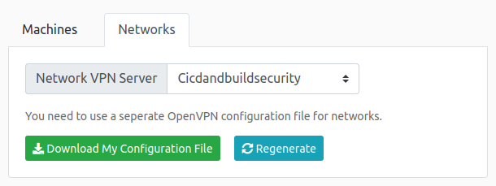
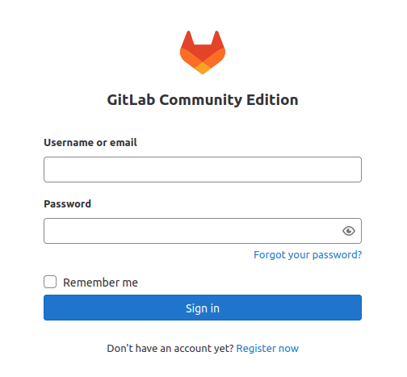

# CI/CD and Build Security

## Introduction

Welcome to the CI/CD and Build Security network! In this room, we will explore what it takes to secure a DevOps pipeline and the builds it produces. Understanding the potential risks and consequences of insecure build processes is essential for recognising the urgency of implementing robust security measures. In this network, we will explore common insecurities and how threat actors can exploit these to compromise not only the process, but also production systems!

Pre-Requisites

SDLC
SSDLC
Intro to Pipeline Automation
Dependency Management
Learning Objectives

Understand the significance of CI/CD and build system security within the DevSecOps pipeline.
Explore the potential risks and consequences associated with insecure CI/CD pipelines and build processes.
Gain awareness of the importance of integrating robust security measures into the build processes to ensure integrity with the deployment of applications.
Learn about the practical attacks that can happen against misconfigured CI/CD pipelines and build processes.

| No answer needed

# Setting Up

Patching In
Let's get you connected to the Nostromo and the greater extra-terrestrial network!

AttackBox

If you are using the Web-based AttackBox, you will be connected to the network automatically if you start the AttackBox from the room's page. You can verify this by running the ping command against the IP of the Gitlab host. You should also take the time to make note of your VPN IP. Using ifconfig or ip a, make a note of the IP of the cicd network adapter. This is your IP and the associated interface that you should use when performing the attacks in the tasks.

Other Hosts

If you are going to use your own attack machine, an OpenVPN configuration file will have been generated for you once you join the room. Go to your access page. Select 'Cicdandbuildsecurity' from the VPN servers (under the network tab) and download your configuration file.



Configuring DNS

There is only two DNS entries for this network that are important. Thus, the simplest is to embed these DNS entry directly into your hosts file regardless of whether you are using the AttackBox or your own machine. To do this, review the network diagram above and make note of the IP of the Gitlab and Jenkins host. Then, perform the following command from a terminal:

`sudo echo <Gitlab IP> gitlab.tryhackme.loc >> /etc/hosts && sudo echo <Jenkins IP> jenkins.tryhackme.loc >> /etc/hosts`

However, if you have already started the network and need to re-add this entry or update it, use your favourite text editor program to directly modify the entry in your /etc/hosts file. Once configured, you can navigate to http://gitlab.tryhackme.loc to verify that your access is working. You should be met with the following page:



Contacting MU-TH-UR 6000

As you progress through this network, you must report your work to the MU-TH-UR 6000 mainframe, better known as Mother. You will have to register with Mother before you begin this perilous journey. SSH is being used for communication as detailed below:

| SSH Username | SSH Password | SSH IP |
| mother | motherknowsbest | X.X.X.250 |

| No answer needed


Use your network diagram to replace the X values in your SSH IP. Once you authenticate, you will be able to communicate with Mother. Follow the prompts to register for the challenge, and save the information you get for future reference. Once registered, follow the instructions to verify that you can access all the relevant systems.

The VPN server and the Mother mainframe are not in scope for this network, and any security testing of these systems may lead to a ban from the network.

As you make your way through the network, you will need to prove your compromises. To do that, you will be requested to perform specific steps on the host that you have compromised. Please note the hostnames in the network diagram above, as you will need this information. Flags can only be accessed from matching hosts.

Note: If the network has been reset or you have joined a new subnet after your time in the network expired, your Mother account will remain active. 

```
ssh mother@10.200.3.250
The authenticity of host '10.200.3.250 (10.200.3.250)' can't be established.
ECDSA key fingerprint is SHA256:F8U+XsY3v1oGOakS44bjm7OEUaXPF5yLyCn1rmFAa7M.
Are you sure you want to continue connecting (yes/no)? yes
Warning: Permanently added '10.200.3.250' (ECDSA) to the list of known hosts.
mother@10.200.3.250's password: 

A... warm.... welcome.... from...


 __  __ _   _     _____ _   _       _   _ ____     __    ___   ___   ___  _ 
|  \/  | | | |   |_   _| | | |     | | | |  _ \   / /_  / _ \ / _ \ / _ \| |
| |\/| | | | |_____| | | |_| |_____| | | | |_) | | '_ \| | | | | | | | | | |
| |  | | |_| |_____| | |  _  |_____| |_| |  _ <  | (_) | |_| | |_| | |_| |_|
|_|  |_|\___/      |_| |_| |_|      \___/|_| \_\  \___/ \___/ \___/ \___/(_)
                                                                            


Please make a selection:
[1] Register
[2] Authenticate
[3] Exit
Selection:1
Please provide your THM username: ragdked


=======================================
Thank you for checking-in with Mother for the CI/CD Network. Be careful, the are hostiles and androids about!
Please take note of the following details and please make sure to save them, as they will not be displayed again.
=======================================
Username: ragdked
Password: tU51JspFywIyRBVI
MailAddr: ragdked@tryhackme.loc
IP Range: 10.200.3.0/24
=======================================

These details are now active.
Once you have performed the actions to take control of the Android's pipeline, please reestablish a connection to mother.
If your access is deemed worthy, mother will award you with a flag for your progress.

=======================================
Please note once again that the VPN server and Mother, 10.200.3.250, are not in-scope for this investigation.
Any attempts made against Mother will result in immediate termination of your contract.
Best of luck on your journey!


Thank you for talking to Mother, goodbye!
Connection to 10.200.3.250 closed.
```