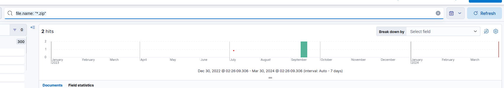
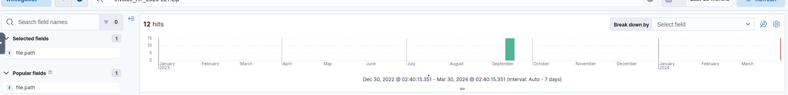
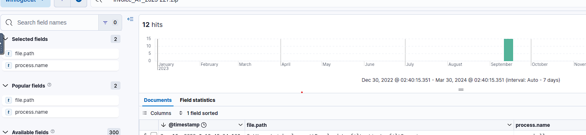
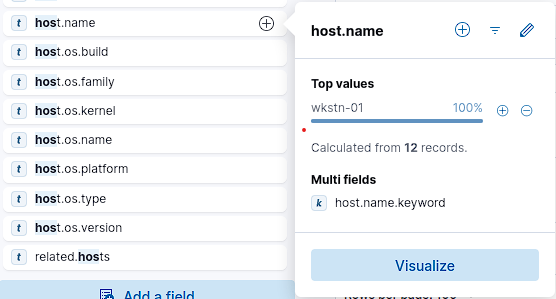
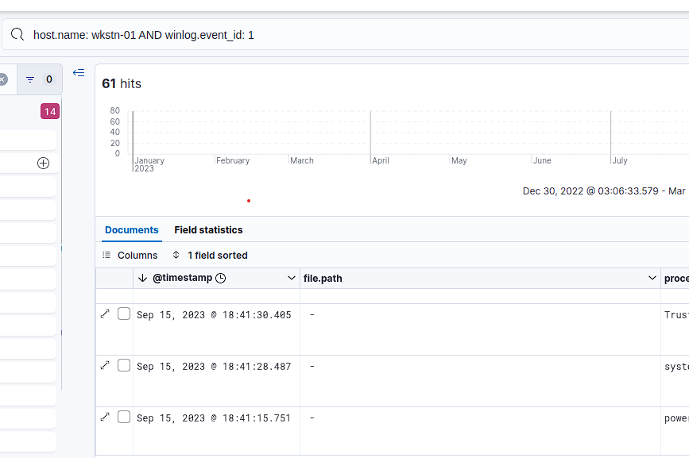
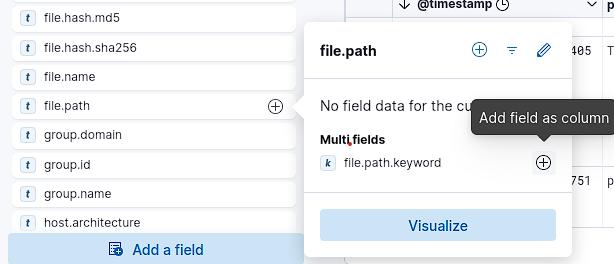
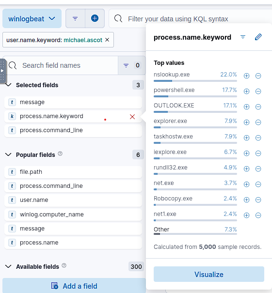
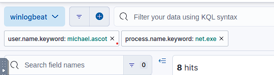

# Hunt Me I: Payment Collectors

## Description
On Friday, September 15, 2023, Michael Ascot, a Senior Finance Director from SwiftSpend, was checking his emails in Outlook and came across an email appearing to be from Abotech Waste Management regarding a monthly invoice for their services. Michael actioned this email and downloaded the attachment to his workstation without thinking.

The following week, Michael received another email from his contact at Abotech claiming they were recently hacked and to carefully review any attachments sent by their employees. However, the damage has already been done. Use the attached Elastic instance to hunt for malicious activity on Michael's workstation and within the SwiftSpend domain!

## Let's Start

### Connection
First, click Start Machine to start the VM attached to this task. You may access the VM using the AttackBox or your VPN connection. You can start the AttackBox by pressing the Start AttackBox button on the top-right of this room. Note: The Elastic Stack may take up to 5 minutes to fully start up. If you receive any errors, give it a few minutes and refresh the page.

### Questions
1. What was the name of the ZIP attachment that Michael downloaded?
We just need to find some *.zip file

Query: `file.name: "*.zip"`

3. What was the contained file that Michael extracted from the attachment?
We have already found zip file which was download by Michael. Now let's watch on this file closely
Choose field `file.path` and paste in the search field name of zip file

5. What was the name of the command-line process that spawned from the extracted file attachment?
Just add new field: `process.name`

7. What URL did the attacker use to download a tool to establish a reverse shell connection?
Still enough to add one another filed: `process.command_line`
Review this column and you will found link to raw.githubusercontent.com

8. What port did the workstation connect to the attacker on?
The same filter just look another parameters from previous answer.

9. What was the first native Windows binary the attacker ran for system enumeration after obtaining remote access?
First, we need to find the `host.name`

Then, watch Windows Event ID - 1.
Query: `host.name: wkstn-01 AND winlog.event_id: 1`

We became 61 hits. You need to find first hit with powershell (HINT: use timestamp 18:41:15.751) and the next process after powershell.exe will be our answer.

11. What is the URL of the script that the attacker downloads to enumerate the domain?
Add new filter `file.path.keyword`

You will see top-5 values. Let's discover the most recent of them - C:\Users\michael.ascot\downloads\PowerView.ps1 (HINT: use timestamp 18:42:23.787)

13. What was the name of the file share that the attacker mapped to Michael's workstation?
First we need to understand which process may be used for this task

In real life you may need to check every point. 
At first - powershell.exe, then net.exe
You need to enable filter `user.name.keyword:michael.ascot` and `process.name.keword: net.exe`

15. What directory did the attacker copy the contents of the file share to?
Actually we can find it at first question. Just repeate steps from first question and you will see directory which used for exfiltrated data

16. What was the name of the Excel file the attacker extracted from the file share?
File creations windows event id - 11, Excel extension - .*xlsx.
Query: `winlog.event_id : 11 AND file.name: *.xlsx`

17. What was the name of the archive file that the attacker created to prepare for exfiltration?
We need to search for the same thing like earlier, but without extension.
Query: `winlog.event_id : 11`

18. What was the name of the archive file that the attacker created to prepare for exfiltration?
Check answer from question 9 and 1. 

19. What is the MITRE ID of the technique that the attacker used to exfiltrate the data?
Check [MITRE ATTACK TACTICS](https://attack.mitre.org/tactics/TA0010/)
This is Exfiltration Over Alternative Protocol

20. What was the domain of the attacker's server that retrieved the exfiltrated data?
We know which tool was used for exfiltration. Just search for this file (HINT: you see thos tool at questions 1, 9 and 12)
Enable filter `powershell.command.value`.

21. The attacker exfiltrated an additional file from the victim's workstation. What is the flag you receive after reconstructing the file?
Search for domain which was founded in previous qustion. There you will see base64 encoded values - it's parts of flag. Flag has divided in two parts.
