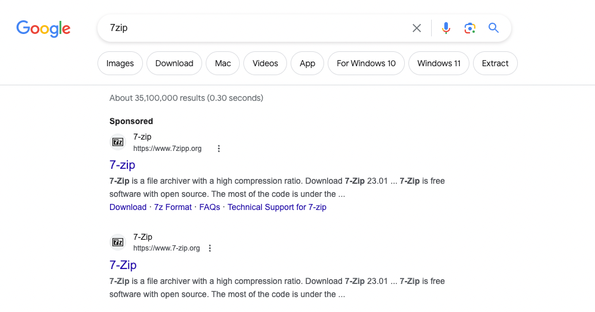

# Hunt Me II: Typo Squatters

## Description

### Scenario

Just working on a typical day as a software engineer, Perry received an encrypted 7z archive from his boss containing a snippet of a source code that must be completed within the day. Realising that his current workstation does not have an application that can unpack the file, he spins up his browser and starts to search for software that can aid in accessing the file. Without validating the resource, Perry immediately clicks the first search engine result and installs the application. 

Last September 26, 2023, one of the security analysts observed something unusual on the workstation owned by Perry based on the generated endpoint and network logs. Given this, your SOC lead has assigned you to conduct an in-depth investigation on this workstation and assess the impact of the potential compromise.

### Connection Details

Deploy the attached machine by clicking the Start Machine button in the upper-right-hand corner of the task. The provided virtual machine runs an Elastic Stack (ELK), which contains the logs that will be used throughout the room. 

Once the machine is up, access the Kibana console (via the AttackBox or VPN) using the following credentials below. The Kibana instance may take up to 3-5 minutes to initialise.

## Challenges

1. What is the URL of the malicious software that was downloaded by the victim user?

It was download in chrome, that's mean process is `chrome.exe`. It may be http or https, that's why you need `http*`

`host.name: WKSTN* AND process.name: chrome.exe AND http*`

2. What is the IP address of the domain hosting the malware?

`network.protocol : dns` -> `dns.question.registered_domain.keyword`

Check `7zipp.org`

3. What is the PID of the process that executed the malicious software?

Check file from first question

`"[REDACTED]"`

add fields `process.pid` , `process.parent.command_line` and `process.command_line`. As we know parent process is `chrome.exe`.

4. Following the execution chain of the malicious payload, another remote file was downloaded and executed. What is the full command line value of this suspicious activity?

`process.command_line: *http*`

There is a lot of results, you need `process.name: powershell.exe`

**OR**

Use `winlog.event_id : (1 OR 3)` and search the same process

5. The newly downloaded script also installed the legitimate version of the application. What is the full file path of the legitimate installer?

If you use `winlog.event_id : (1 OR 3)` then here just search for `process.parent.command_line` from answer at previous question

6. What is the name of the service that was installed?

The same KQL, you need to find some service creation (HINT: it's made by sc.exe)

7. The attacker was able to establish a C2 connection after starting the implanted service. What is the username of the account that executed the service?

Find `user.name` at previous result

8. After dumping LSASS data, the attacker attempted to parse the data to harvest the credentials. What is the name of the tool used by the attacker in this activity?

`*lsass.DMP*`

9. What is the credential pair that the attacker leveraged after the credential dumping activity? (format: username:hash)

`winlog.event_id : 1 AND process.command_line : *mimikatz*`

`winlog.event_id : 1` - process creation
`process.command_line : *mimikatz*` - most famous tool to work with windows credentials

10. After gaining access to the new account, the attacker attempted to reset the credentials of another user. What is the new password set to this target account?

11. What is the name of the workstation where the new account was used?

12. After gaining access to the new workstation, a new set of credentials was discovered. What is the username, including its domain, and password of this new account?

13. Aside from mimikatz, what is the name of the PowerShell script used to dump the hash of the domain admin?

14. What is the AES256 hash of the domain admin based on the credential dumping output?

15. After gaining domain admin access, the attacker popped ransomware on workstations. How many files were encrypted on all workstations?